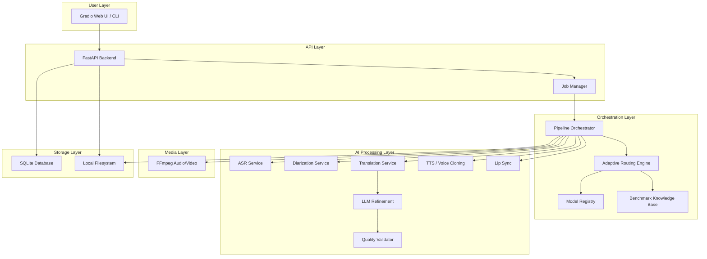
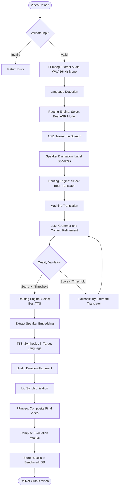
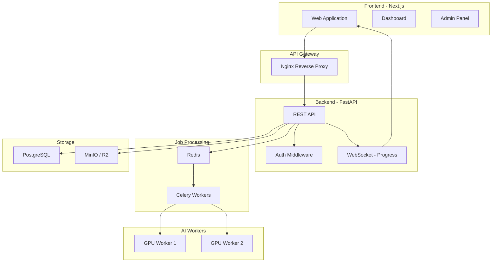

# Adaptive AI Framework for Multilingual Video Localization
## Complete Engineering & Research Plan

> **Document Version**: 1.0  
> **Date**: August 2026  
> **Status**: AWAITING APPROVAL — Do not begin implementation until this plan is reviewed.

---

# Table of Contents

1. [Executive Summary](#1-executive-summary)
2. [Requirements](#2-requirements)
3. [Prerequisites](#3-prerequisites)
4. [Free-First Technology Stack](#4-free-first-technology-stack)
5. [AI Model Stack](#5-ai-model-stack)
6. [Final MVP Model Stack](#6-final-mvp-model-stack)
7. [End-to-End Architecture](#7-end-to-end-architecture)
8. [AI Pipeline](#8-ai-pipeline)
9. [Adaptive Model Routing Engine](#9-adaptive-model-routing-engine)
10. [Benchmark Knowledge Base](#10-benchmark-knowledge-base)
11. [Experimental Methodology](#11-experimental-methodology)
12. [Datasets](#12-datasets)
13. [Research Questions and Hypotheses](#13-research-questions-and-hypotheses)
14. [Quality Validation Layer](#14-quality-validation-layer)
15. [SaaS Architecture](#15-saas-architecture)
16. [Database Design](#16-database-design)
17. [API Design](#17-api-design)
18. [Repository Structure](#18-repository-structure)
19. [Development Roadmap](#19-development-roadmap)
20. [Demo Strategy](#20-demo-strategy)
21. [Performance and Hardware Plan](#21-performance-and-hardware-plan)
22. [Security and Ethics](#22-security-and-ethics)
23. [Testing Strategy](#23-testing-strategy)
24. [Risks and Mitigation](#24-risks-and-mitigation)
25. [Definition of Done](#25-definition-of-done)
26. [What NOT to Build](#26-what-not-to-build)
27. [Final Recommendation](#27-final-recommendation)

---

# 1. Executive Summary

## Problem

Video content is inherently monolingual. A Hindi-speaking creator publishing on YouTube cannot reach Tamil, Telugu, or Bengali audiences without manual dubbing — a process that costs ₹15,000–₹50,000+ per video, takes days, and requires professional voice actors, translators, and video editors. Commercial platforms (ElevenLabs, HeyGen, Dubverse) exist but are proprietary black boxes that charge per-minute fees, offer no transparency into model selection, and often fail on low-resource Indic languages by forcing all content through a single global model.

## Users

- Independent content creators seeking affordable multilingual reach
- Educational institutions localizing courseware
- Media production studios requiring scalable dubbing
- Researchers studying multilingual AI pipeline architectures

## What the Product Does

The system accepts a source video, and produces a fully localized video in a target language — with the speaker's own cloned voice and synchronized lip movements. The pipeline performs: audio extraction → language detection → speech recognition → speaker diarization → machine translation → grammar refinement → quality validation → voice cloning/TTS → lip synchronization → final video rendering.

## Technical Novelty

The core contribution is **not** a new foundational AI model. It is an **Adaptive AI Orchestration Framework** — a data-driven routing engine that:

1. Maintains a **Benchmark Knowledge Base** of evaluation metrics (WER, BLEU, COMET, chrF, SECS, LSE-D) for candidate models across language pairs
2. Dynamically selects the best-performing model for each pipeline stage based on the detected source/target language pair
3. Applies a **Quality Validation Layer** that detects hallucinations and low-confidence outputs, triggering automatic fallback to an alternate model
4. Measures **error propagation** across the pipeline to identify the weakest link

This transforms a static "download-and-run" integration into a rigorous systems engineering problem with measurable, reproducible research outcomes.

## Research Contribution

- Empirical comparison of open-source AI models for Indic language video localization
- Error propagation analysis across a multi-stage AI pipeline
- Design and evaluation of a confidence-based adaptive routing mechanism
- Benchmarking an open-source framework against commercial platforms

## MVP Demonstration

A working CLI + simple web interface that takes a 1–3 minute English video and produces a Hindi-dubbed output with cloned voice and lip-synced visuals — running entirely on a local 8GB VRAM GPU with zero paid API calls.

## Future Production Scope

Multi-tenant SaaS platform with user authentication, project management, job queuing, billing, real-time progress tracking, enterprise API, and GPU-cluster autoscaling.

---

# 2. Requirements

## 2.1 Functional Requirements

| ID | Requirement | Priority | MVP/Future |
|----|-------------|----------|------------|
| FR-01 | Accept video upload (MP4, MKV, AVI, WebM) | P0 | MVP |
| FR-02 | Extract audio track from video using FFmpeg | P0 | MVP |
| FR-03 | Detect source language automatically | P0 | MVP |
| FR-04 | Transcribe speech to text with timestamps | P0 | MVP |
| FR-05 | Identify and label distinct speakers (diarization) | P1 | MVP |
| FR-06 | Translate transcript to target language | P0 | MVP |
| FR-07 | Refine translation using LLM for grammar/context | P1 | MVP |
| FR-08 | Validate translation quality and detect hallucinations | P1 | MVP |
| FR-09 | Fall back to alternate model if quality is below threshold | P1 | MVP |
| FR-10 | Clone speaker voice and synthesize speech in target language | P0 | MVP |
| FR-11 | Synchronize generated audio with speaker lip movements | P0 | MVP |
| FR-12 | Render final video with dubbed audio | P0 | MVP |
| FR-13 | Support at least 2 Indic target languages (Hindi, Marathi) | P0 | MVP |
| FR-14 | Display supported languages list | P1 | MVP |
| FR-15 | Provide downloadable output video | P0 | MVP |
| FR-16 | Show processing pipeline progress | P1 | MVP |
| FR-17 | Display evaluation metrics for each pipeline stage | P1 | MVP |
| FR-18 | Adaptive model selection based on language pair | P1 | MVP |
| FR-19 | User project management (create, list, delete) | P2 | Future |
| FR-20 | Batch video processing | P2 | Future |
| FR-21 | Subtitle generation and embedding | P2 | Future |
| FR-22 | Real-time streaming localization | P2 | Future |

## 2.2 Non-Functional Requirements

| ID | Requirement | Priority | MVP/Future |
|----|-------------|----------|------------|
| NFR-01 | Process a 1-min video within 10 minutes on 8GB GPU | P0 | MVP |
| NFR-02 | Run entirely without paid API calls | P0 | MVP |
| NFR-03 | Operate on Windows with NVIDIA GPU | P0 | MVP |
| NFR-04 | Sequential model loading to fit 8GB VRAM | P0 | MVP |
| NFR-05 | Graceful error handling with informative messages | P1 | MVP |
| NFR-06 | Structured logging for debugging | P1 | MVP |
| NFR-07 | Concurrent job processing (2+ jobs) | P2 | Future |
| NFR-08 | Horizontal scalability via containerization | P2 | Future |
| NFR-09 | Response time <500ms for API endpoints (non-AI) | P2 | Future |

## 2.3 Research Requirements

| ID | Requirement | Priority | MVP/Future |
|----|-------------|----------|------------|
| RR-01 | Quantitative evaluation using WER, BLEU, COMET, chrF | P0 | MVP |
| RR-02 | SECS measurement for voice similarity | P1 | MVP |
| RR-03 | LSE-C/LSE-D for lip sync quality | P1 | MVP |
| RR-04 | Comparative experiment: static vs adaptive routing | P0 | MVP |
| RR-05 | Error propagation analysis across pipeline stages | P1 | MVP |
| RR-06 | Benchmark against at least one commercial platform | P1 | MVP |
| RR-07 | Reproducible experiment scripts and datasets | P0 | MVP |
| RR-08 | Latency and GPU resource profiling | P1 | MVP |

## 2.4 SaaS/Product Requirements

| ID | Requirement | Priority | MVP/Future |
|----|-------------|----------|------------|
| SR-01 | Web-based upload interface | P1 | MVP (simple) |
| SR-02 | User authentication (login/signup) | P2 | Future |
| SR-03 | Project/workspace management | P2 | Future |
| SR-04 | Usage quotas and billing placeholder | P2 | Future |
| SR-05 | Admin dashboard with system metrics | P2 | Future |
| SR-06 | API key management | P2 | Future |
| SR-07 | Multi-tenant isolation | P2 | Future |

## 2.5 Security Requirements

| ID | Requirement | Priority | MVP/Future |
|----|-------------|----------|------------|
| SEC-01 | Uploaded videos stored temporarily, auto-deleted | P1 | MVP |
| SEC-02 | No user video data persisted beyond processing | P1 | MVP |
| SEC-03 | Voice cloning consent acknowledgment in UI | P1 | MVP |
| SEC-04 | Generated content labeled as AI-produced | P1 | MVP |
| SEC-05 | HTTPS for all web traffic | P2 | Future |
| SEC-06 | API rate limiting | P2 | Future |
| SEC-07 | Input validation (file type, size, duration) | P1 | MVP |

## 2.6 Performance Requirements

| ID | Requirement | Target | MVP/Future |
|----|-------------|--------|------------|
| PR-01 | Peak VRAM usage per job | ≤7.5 GB | MVP |
| PR-02 | 1-minute video end-to-end time | ≤10 min | MVP |
| PR-03 | Audio extraction latency | ≤5 sec | MVP |
| PR-04 | ASR latency (1 min audio) | ≤30 sec | MVP |
| PR-05 | Translation latency (500 words) | ≤10 sec | MVP |
| PR-06 | TTS generation (1 min audio) | ≤60 sec | MVP |
| PR-07 | Lip sync processing (1 min video) | ≤120 sec | MVP |

## 2.7 Scalability Requirements

| ID | Requirement | Priority | MVP/Future |
|----|-------------|----------|------------|
| SC-01 | Single-user, single-job processing | P0 | MVP |
| SC-02 | Queue-based multi-job processing | P2 | Future |
| SC-03 | Horizontal GPU worker scaling | P2 | Future |
| SC-04 | CDN-based output delivery | P2 | Future |

---

# 3. Prerequisites

## 3.1 Hardware

| Component | Minimum (MVP) | Recommended | Notes |
|-----------|---------------|-------------|-------|
| GPU | NVIDIA with 8GB VRAM (e.g. RTX 3060/4060) | 12–16GB VRAM (RTX 3080/4070 Ti) | CUDA compute capability ≥7.0 |
| RAM | 16 GB | 32 GB | Models may spill to system RAM |
| Storage | 50 GB free | 100 GB free | Model weights + temp video files |
| CPU | 4-core modern x86_64 | 8-core | FFmpeg rendering is CPU-bound |
| Internet | Required for initial model download | — | Models cached locally after first download |

## 3.2 Software

| Software | Version | Status | Notes |
|----------|---------|--------|-------|
| **Windows** | 10/11 (64-bit) | REQUIRED FOR MVP | Primary dev environment |
| **Python** | 3.10 or 3.11 | REQUIRED FOR MVP | 3.10 recommended for widest library compat; 3.14 may have issues with some ML libs |
| **Node.js** | 18 LTS or 20 LTS | RECOMMENDED | For web frontend; not needed for CLI-only MVP |
| **FFmpeg** | 6.x or 7.x | REQUIRED FOR MVP | Must be on PATH; needed for all audio/video processing |
| **CUDA Toolkit** | 11.8 or 12.1 | REQUIRED FOR MVP | Must match PyTorch CUDA version |
| **cuDNN** | 8.x (matching CUDA) | REQUIRED FOR MVP | GPU acceleration for deep learning |
| **NVIDIA Driver** | ≥525.x | REQUIRED FOR MVP | Check with `nvidia-smi` |
| **Git** | 2.x | REQUIRED FOR MVP | Version control |
| **Git LFS** | 3.x | RECOMMENDED | Some model repos use LFS |
| **Docker** | Desktop 4.x | OPTIONAL | For containerized deployment; not needed for MVP |
| **Redis** | 7.x | OPTIONAL | Job queue for SaaS; not needed for MVP |
| **PostgreSQL** | 15 or 16 | PRODUCTION ONLY | SQLite used for MVP |

## 3.3 Python Packages (Key)

| Package | Purpose | Status |
|---------|---------|--------|
| `torch` + `torchaudio` | Core ML framework | REQUIRED |
| `faster-whisper` | ASR (CTranslate2-optimized) | REQUIRED |
| `transformers` | NLLB/SeamlessM4T/LLM inference | REQUIRED |
| `ctranslate2` | Optimized inference for translation models | REQUIRED |
| `pyannote.audio` | Speaker diarization | REQUIRED |
| `TTS` (Coqui) | XTTS voice cloning | REQUIRED |
| `openvoice` | Alternative voice cloning | RECOMMENDED |
| `fastapi` + `uvicorn` | Backend API server | REQUIRED |
| `jiwer` | WER/CER computation | REQUIRED |
| `sacrebleu` | BLEU/chrF computation | REQUIRED |
| `unbabel-comet` | COMET metric | RECOMMENDED |
| `resemblyzer` | Speaker embedding / SECS | RECOMMENDED |
| `gradio` | Simple demo UI (MVP) | RECOMMENDED |
| `pydub` / `librosa` | Audio processing utilities | REQUIRED |
| `opencv-python` | Video frame processing | REQUIRED |
| `numpy`, `scipy`, `pandas` | Data processing | REQUIRED |
| `pydantic` | Data validation | REQUIRED |
| `sqlalchemy` | ORM for database | REQUIRED |
| `loguru` | Structured logging | RECOMMENDED |

## 3.4 Required Model Files (Downloaded on First Run)

| Model | Approximate Size | Download Source |
|-------|-----------------|----------------|
| Faster-Whisper medium | ~1.5 GB | Hugging Face (Systran) |
| NLLB-200-distilled-600M (CTranslate2) | ~1.2 GB | Hugging Face |
| Pyannote segmentation-3.0 | ~200 MB | Hugging Face (requires acceptance) |
| XTTS-v2 | ~1.8 GB | Hugging Face (Coqui) |
| Wav2Lip + SyncNet | ~400 MB | GitHub (Rudrabha) |
| Qwen2.5-1.5B-Instruct (GGUF Q4) | ~1.0 GB | Hugging Face |

**Total first-download**: ~6.1 GB

## 3.5 Required Accounts

| Account | Purpose | Free? | Required? |
|---------|---------|-------|-----------|
| Hugging Face | Download models, accept gated model licenses | Yes | REQUIRED |
| GitHub | Version control, code hosting | Yes | REQUIRED |
| Google Account | Colab backup (if local GPU fails) | Yes | OPTIONAL |

> [!NOTE]
> **pyannote.audio** requires accepting the model license on Hugging Face and generating an access token. This is free but requires a Hugging Face account.

---

# 4. Free-First Technology Stack

## 4.1 Stack Selection Matrix

| Layer | Selected | Alternatives Considered | Why Selected |
|-------|----------|------------------------|-------------|
| **Frontend (MVP)** | Gradio | Streamlit, React | Zero-config Python UI; auto-generates upload forms, progress bars, output display; no Node.js or npm needed; ships with the Python backend |
| **Frontend (SaaS)** | Next.js 14 + TypeScript + Tailwind | React+Vite, SvelteKit | SSR, file-based routing, built-in API routes, industry standard for SaaS |
| **Backend** | FastAPI (Python 3.10) | Flask, Django | Async-native, auto-generated OpenAPI docs, Pydantic validation, excellent for ML serving, production-grade performance |
| **Database (MVP)** | SQLite | — | Zero-config, file-based, perfect for single-user research prototype; no installation needed |
| **Database (SaaS)** | PostgreSQL 16 | MySQL, MongoDB | ACID-compliant, JSON support, excellent ORM ecosystem, industry standard |
| **Queue (MVP)** | Python `threading` + `queue` | — | No external dependencies; sufficient for single-user, single-job MVP |
| **Queue (SaaS)** | Redis 7 + Celery | RabbitMQ, BullMQ | Redis doubles as cache; Celery is the Python standard for distributed task queues |
| **Video Processing** | FFmpeg 7.x | MoviePy, OpenCV | Industry standard, handles every codec, extremely fast, well-documented |
| **AI Inference** | PyTorch 2.x + CTranslate2 | ONNX Runtime, TensorRT | Widest model support; CTranslate2 gives 2–4x speedup on supported models (Whisper, NLLB) |
| **Object Storage (MVP)** | Local filesystem | — | No setup; videos stored in `./data/uploads/` and `./data/outputs/` |
| **Object Storage (SaaS)** | MinIO (self-hosted) or Cloudflare R2 (10GB free) | AWS S3 | MinIO is S3-compatible and free; R2 has generous free tier with no egress fees |
| **Auth (MVP)** | None (single-user) | — | Unnecessary complexity for research demo |
| **Auth (SaaS)** | NextAuth.js | Auth0, Clerk, Supabase Auth | Free, open-source, supports OAuth/credentials, first-party Next.js integration |
| **Monitoring (MVP)** | Loguru + console | — | Structured JSON logging to files; simple and effective |
| **Monitoring (SaaS)** | Grafana + Prometheus | Datadog, New Relic | Free, open-source, self-hosted, industry standard |
| **Containerization** | Docker + Docker Compose | Podman | Industry standard; NVIDIA Container Toolkit for GPU passthrough |

## 4.2 Decision Rationale: Why Gradio for MVP Frontend

A full React/Next.js frontend requires: Node.js installation, npm dependency management, build tooling, CORS configuration, and separate deployment. For a research prototype demonstrated to faculty, this adds 1–2 weeks of development with no research value.

Gradio provides:
- File upload with drag-and-drop
- Progress bars and status display
- Audio/video playback for input and output
- Tabbed interfaces for different views (pipeline, evaluation, benchmarks)
- Auto-generated shareable link for remote demos
- Runs inside the Python process — zero additional infrastructure

The SaaS frontend (Next.js) is designed separately and built in Phase 9.

---

# 5. AI Model Stack

## 5.1 ASR (Automatic Speech Recognition)

| Property | Faster-Whisper (medium) | Whisper (large-v3) | SeamlessM4T v2 (medium) |
|----------|------------------------|--------------------|-----------------------|
| **Paper** | OpenAI Whisper (Radford et al., 2022) + CTranslate2 | OpenAI Whisper (Radford et al., 2022) | Meta SeamlessM4T (Barrault et al., 2023) |
| **License** | MIT | MIT | CC-BY-NC 4.0 |
| **Type** | Open-source | Open-source | Open-weight (non-commercial) |
| **Languages** | 99 | 99 | 100+ |
| **Indic Support** | Hindi, Bengali, Tamil, Telugu, Marathi, Gujarati, Kannada, Malayalam, Punjabi, Urdu | Same | Same + additional Indic |
| **VRAM** | ~2 GB | ~10 GB (too large for 8GB) | ~4 GB |
| **CPU Fallback** | Yes (CTranslate2) | Yes (slow) | Yes (very slow) |
| **Speed** | ~4x real-time on GPU | ~1x real-time on GPU | ~1.5x real-time |
| **Published WER (English)** | ~5% (medium model; Radford et al.) | ~3% (large-v3; Radford et al.) | Not directly comparable (different benchmark) |
| **Published WER (Hindi)** | Not formally reported for medium | ~14% (large-v3; reported in literature) | Not directly comparable |
| **Known Limitations** | Smaller model = higher WER on low-resource languages | Exceeds 8GB VRAM | NC license restricts commercial use |
| **Free Local Inference?** | ✅ Yes | ❌ Too large for 8GB | ✅ Yes (non-commercial) |
| **MVP Recommended?** | ✅ **PRIMARY** | ❌ | 🔶 Candidate for routing |
| **Adaptive Routing Candidate?** | ✅ | ❌ (VRAM) | ✅ |

> [!NOTE]
> Whisper large-v3 is excluded from MVP due to VRAM constraints. It can be evaluated on Google Colab for benchmark comparison.

## 5.2 Machine Translation

| Property | NLLB-200-distilled-600M | SeamlessM4T v2 | IndicTrans2 (1B) |
|----------|------------------------|----------------|-------------------|
| **Paper** | NLLB Team (2022) | Barrault et al. (2023) | Gala et al. (2023), AI4Bharat |
| **License** | CC-BY-NC 4.0 | CC-BY-NC 4.0 | MIT |
| **Type** | Open-weight | Open-weight | Open-source |
| **Language Pairs** | 200 × 200 | 100+ → 100+ | 22 Indic ↔ English + Indic ↔ Indic |
| **Indic Support** | Broad but not specialized | Broad | **Deep** — trained specifically on Indic languages |
| **VRAM** | ~1.5 GB (CTranslate2) | ~4 GB | ~4 GB |
| **Published BLEU (en→hi)** | ~24 BLEU (FLORES; NLLB paper) | ~28 BLEU (reported in SeamlessM4T paper) | ~33 BLEU (FLORES; AI4Bharat paper) |
| **Published BLEU (en→mr)** | ~15 BLEU (FLORES) | Not individually reported | ~22 BLEU (FLORES) |
| **Known Limitations** | Distilled = lower quality; occasional hallucination on rare language pairs | NC license; large model | English-centric; limited non-Indic pairs |
| **Free Local Inference?** | ✅ Yes | ✅ Yes (NC) | ✅ Yes |
| **MVP Recommended?** | ✅ **PRIMARY** (smallest, broadest) | 🔶 Candidate | 🔶 Candidate (Indic-specialized) |
| **Routing Candidate?** | ✅ | ✅ | ✅ |

> [!IMPORTANT]
> The BLEU scores above are from the respective papers evaluated on FLORES-200. They are **not** our experimental results. Our experiments will independently verify these on our test sets.

## 5.3 LLM for Grammar Refinement

| Property | Qwen2.5-1.5B-Instruct | Phi-3-mini-4k (3.8B, Q4) | Gemma-2-2B-it |
|----------|----------------------|---------------------------|---------------|
| **License** | Apache 2.0 | MIT | Gemma license (permissive) |
| **VRAM (quantized)** | ~1.2 GB (Q4_K_M) | ~2.5 GB (Q4) | ~1.8 GB (Q4) |
| **Multilingual** | Strong (especially CJK + English) | English-primary | Good multilingual |
| **Indic capability** | Moderate | Limited | Moderate |
| **Inference Speed** | Fast | Moderate | Fast |
| **Known Limitations** | Smaller context may miss nuance | Hindi/Indic grammar correction weak | Limited Indic training data |
| **Free Local Inference?** | ✅ Yes | ✅ Yes | ✅ Yes |
| **MVP Recommended?** | ✅ **PRIMARY** | 🔶 Fallback | 🔶 Candidate |

> [!NOTE]
> The LLM is used for **post-editing** only — fixing grammar, resolving gender ambiguity, preserving named entities. It does NOT perform translation.

## 5.4 Speaker Diarization

| Property | pyannote.audio 3.1 |
|----------|-------------------|
| **Paper** | Bredin & Laurent (2023) |
| **License** | MIT (code), gated model (free, requires HF acceptance) |
| **VRAM** | ~1 GB |
| **Quality** | State-of-the-art on AMI/VoxConverse benchmarks |
| **Known Limitations** | Requires HF token; struggles with heavily overlapping speech |
| **Free Local Inference?** | ✅ Yes |
| **MVP Recommended?** | ✅ **Yes** (no viable free alternative at this quality) |

## 5.5 TTS / Voice Cloning

| Property | XTTS-v2 (Coqui) | OpenVoice v2 |
|----------|-----------------|--------------|
| **Paper** | Casanova et al. (2024) | Qin et al. (2024) |
| **License** | CPML (non-commercial) | MIT |
| **Type** | Open-weight | Open-source |
| **VRAM** | ~2 GB | ~1.5 GB |
| **Languages** | 17 (including Hindi) | English + tone/style cloning; language list growing |
| **Indic TTS** | Hindi, limited others | Limited direct Indic TTS |
| **Voice Cloning** | Zero-shot from ~6 sec reference | Zero-shot from ~10 sec reference |
| **Quality** | High naturalness; good speaker similarity | Good style transfer; speaker similarity moderate |
| **Known Limitations** | CPML license; occasional artifacts on Indic; slower generation | Indic language generation limited; may need MeloTTS backend |
| **Free Local Inference?** | ✅ Yes | ✅ Yes |
| **MVP Recommended?** | ✅ **PRIMARY** | 🔶 Fallback/Candidate |

## 5.6 Lip Synchronization

| Property | Wav2Lip | MuseTalk | LatentSync |
|----------|---------|----------|------------|
| **Paper** | Prajwal et al. (2020) | — (Tencent, 2024) | Xu et al. (2024) |
| **License** | Custom (research use) | Custom | Apache 2.0 |
| **VRAM** | ~1–2 GB | ~4 GB | ~6 GB |
| **Quality** | Good sync, lower visual quality (blurry mouth) | Better visual quality | Best visual quality, latest research |
| **Speed** | Fast (~5x real-time) | Moderate | Slow (~0.5x real-time) |
| **Known Limitations** | Blurry mouth region; needs face detection | Complex setup; less documented | High VRAM; slow; complex dependencies |
| **Free Local Inference?** | ✅ Yes | ✅ Yes | ✅ Yes |
| **MVP Recommended?** | ✅ **PRIMARY** (proven, fast, low VRAM) | 🔶 Candidate | 🔶 Candidate (if VRAM allows) |

---

# 6. Final MVP Model Stack

## 6.1 Primary Stack (Fits ~8 GB VRAM with Sequential Loading)

| Pipeline Stage | Model | VRAM | Load Time |
|---------------|-------|------|-----------|
| ASR | Faster-Whisper medium (CTranslate2) | ~2.0 GB | ~3 sec |
| Diarization | pyannote.audio 3.1 | ~1.0 GB | ~2 sec |
| Translation | NLLB-200-distilled-600M (CTranslate2) | ~1.5 GB | ~2 sec |
| LLM Refinement | Qwen2.5-1.5B-Instruct (GGUF Q4_K_M via llama-cpp-python) | ~1.2 GB | ~3 sec |
| TTS / Voice Clone | XTTS-v2 | ~2.0 GB | ~5 sec |
| Lip Sync | Wav2Lip + face detection | ~1.5 GB | ~3 sec |

**Peak VRAM (any single model)**: ~2.0 GB  
**Strategy**: Load one model → process → unload → load next model  
**Total model disk space**: ~6.1 GB

## 6.2 Fallback Stack

| Stage | Primary Fails Because... | Fallback Model |
|-------|--------------------------|----------------|
| ASR | Faster-Whisper quality poor on Indic | SeamlessM4T (S2T mode) |
| Translation | NLLB hallucination on rare pair | IndicTrans2 (for en↔Indic) |
| LLM | Qwen insufficient Hindi grammar | Gemma-2-2B-it (Q4) |
| TTS | XTTS fails on specific language | OpenVoice v2 + MeloTTS |
| Lip Sync | Wav2Lip too blurry | MuseTalk (if VRAM allows) |

## 6.3 VRAM Loading Strategy (Critical for 8GB)

```
┌────────────────────────────────────────────┐
│         SEQUENTIAL MODEL LOADING           │
│                                            │
│  Step 1: Load Faster-Whisper → ASR         │
│          ↓ Unload                          │
│  Step 2: Load pyannote → Diarize           │
│          ↓ Unload                          │
│  Step 3: Load NLLB → Translate             │
│          ↓ Unload                          │
│  Step 4: Load Qwen → LLM Refine           │
│          ↓ Unload                          │
│  Step 5: Load XTTS → Voice Synthesis       │
│          ↓ Unload                          │
│  Step 6: Load Wav2Lip → Lip Sync           │
│          ↓ Unload                          │
│  Step 7: FFmpeg → Render (CPU-only)        │
│                                            │
│  Max VRAM at any point: ~2 GB              │
│  Remaining VRAM: ~6 GB headroom            │
└────────────────────────────────────────────┘
```

> [!TIP]
> Between each step, we call `torch.cuda.empty_cache()` and `gc.collect()` to ensure VRAM is fully released before loading the next model.

---

# 7. End-to-End Architecture

## 7.1 High-Level Architecture



## 7.2 Detailed AI Pipeline Architecture



---

# 8. AI Pipeline

## Step-by-Step Pipeline Specification

### Step 1: Video Upload & Validation

| Property | Value |
|----------|-------|
| **Input** | Raw video file (MP4/MKV/AVI/WebM) |
| **Processing** | Validate file type, size (≤500 MB for MVP), duration (≤10 min); check for audio stream; probe codec info via FFprobe |
| **Tool** | FFprobe |
| **Output** | Validated video metadata (duration, resolution, codec, audio channels) |
| **Failure Cases** | No audio stream; unsupported codec; file corrupted; file too large |
| **Fallback** | Return descriptive error message to user |
| **Metrics** | Validation latency |

### Step 2: Audio Extraction

| Property | Value |
|----------|-------|
| **Input** | Validated video file |
| **Processing** | Extract audio track; convert to WAV 16kHz mono (optimal for ASR models) |
| **Tool** | FFmpeg: `ffmpeg -i input.mp4 -ar 16000 -ac 1 -vn output.wav` |
| **Output** | `audio.wav` (16kHz, mono, PCM) |
| **Failure Cases** | FFmpeg not installed; corrupt audio stream |
| **Fallback** | Try alternate codec extraction; fallback to `-acodec pcm_s16le` |
| **Metrics** | Extraction time (seconds) |

### Step 3: Language Detection

| Property | Value |
|----------|-------|
| **Input** | `audio.wav` |
| **Processing** | Run Faster-Whisper with `detect_language()` on first 30 seconds of audio |
| **Tool** | Faster-Whisper built-in language detection |
| **Output** | ISO 639-1 language code (e.g., `en`, `hi`, `mr`) + confidence score |
| **Failure Cases** | Music-only audio; multiple languages in clip; very short audio |
| **Fallback** | Use user-specified source language if detection confidence < 0.5 |
| **Metrics** | Detection accuracy; detection latency |

### Step 4: Adaptive ASR Model Routing

| Property | Value |
|----------|-------|
| **Input** | Detected source language code |
| **Processing** | Query Benchmark Knowledge Base for ASR models evaluated on this language; rank by WER; select top-scoring model that fits VRAM |
| **Tool** | Routing Engine (custom) |
| **Output** | Selected ASR model identifier + expected WER |
| **Failure Cases** | No benchmark data for language; all candidates exceed VRAM |
| **Fallback** | Default to Faster-Whisper medium (most broadly evaluated) |
| **Metrics** | Routing decision time; routing justification log |

### Step 5: Speech-to-Text (ASR)

| Property | Value |
|----------|-------|
| **Input** | `audio.wav` + selected ASR model |
| **Processing** | Transcribe with word-level timestamps; apply VAD filtering |
| **Tool** | Faster-Whisper / SeamlessM4T (depending on route) |
| **Output** | List of `{text, start_time, end_time, confidence}` segments |
| **Failure Cases** | Very noisy audio → garbled output; hallucination on silence |
| **Fallback** | Re-run with increased VAD aggressiveness; try alternate ASR model |
| **Metrics** | WER, CER (if reference available); inference time; confidence scores |

### Step 6: Speaker Diarization

| Property | Value |
|----------|-------|
| **Input** | `audio.wav` + optional `num_speakers` hint |
| **Processing** | Segment audio by speaker identity; assign speaker labels (SPEAKER_00, SPEAKER_01, ...) |
| **Tool** | pyannote.audio 3.1 |
| **Output** | List of `{speaker_id, start_time, end_time}` segments |
| **Failure Cases** | Overlapping speech; music confused as speaker; single speaker detected as multiple |
| **Fallback** | Assign all segments to SPEAKER_00 if diarization fails; allow user to specify speaker count |
| **Metrics** | DER (Diarization Error Rate, if reference available); segment count |

### Step 7: Segment Alignment

| Property | Value |
|----------|-------|
| **Input** | ASR transcript segments + diarization segments |
| **Processing** | Merge ASR timestamps with speaker labels using overlap matching |
| **Tool** | Custom alignment logic (timestamp intersection) |
| **Output** | List of `{speaker_id, text, start_time, end_time}` |
| **Failure Cases** | Timestamp misalignment between ASR and diarization |
| **Fallback** | Use ASR timestamps only; discard diarization data if alignment fails |
| **Metrics** | Alignment accuracy (manual inspection for MVP) |

### Step 8: Adaptive Translation Routing

| Property | Value |
|----------|-------|
| **Input** | Source language + target language |
| **Processing** | Query Benchmark KB for translation models evaluated on this language pair; rank by composite score (BLEU + COMET); select top model |
| **Tool** | Routing Engine |
| **Output** | Selected translation model identifier + expected BLEU |
| **Failure Cases** | No benchmark data for language pair; unsupported pair |
| **Fallback** | Default to NLLB-200-distilled-600M (broadest language coverage) |
| **Metrics** | Routing decision log |

### Step 9: Machine Translation

| Property | Value |
|----------|-------|
| **Input** | Source text segments + selected translation model + target language |
| **Processing** | Translate each segment individually; preserve segment boundaries for timing |
| **Tool** | NLLB / IndicTrans2 / SeamlessM4T (per route) |
| **Output** | Translated text segments with preserved metadata |
| **Failure Cases** | Hallucination (output in wrong language); empty output; excessively long/short output |
| **Fallback** | Detected by Quality Validation Layer → retry with alternate model |
| **Metrics** | BLEU, chrF, COMET (if reference available); output language detection check |

### Step 10: LLM Grammar & Context Refinement

| Property | Value |
|----------|-------|
| **Input** | Translated text segments + source text (for reference) |
| **Processing** | Prompt LLM to fix grammar errors, resolve gender ambiguity, preserve named entities, ensure natural sentence flow in target language |
| **Tool** | Qwen2.5-1.5B-Instruct (via llama-cpp-python) |
| **Output** | Refined translated text segments |
| **Failure Cases** | LLM introduces new errors; changes meaning; hallucination |
| **Fallback** | Use unrefined translation if LLM output diverges too much from input (measured by edit distance) |
| **Metrics** | Edit distance from input; BLEU before/after refinement |

### Step 11: Quality Validation

| Property | Value |
|----------|-------|
| **Input** | Refined translated text + source text + source language + target language |
| **Processing** | Run validation checks (see Section 14); compute confidence score |
| **Tool** | Custom validator + optional COMET-QE (reference-free) |
| **Output** | Quality score (0–1) + pass/fail decision + list of flagged issues |
| **Failure Cases** | — (this IS the failure detection mechanism) |
| **Fallback** | If score < threshold: retry with alternate translation model (max 1 retry) |
| **Metrics** | Validation pass rate; average confidence score; false positive rate |

### Step 12: Voice Cloning & TTS

| Property | Value |
|----------|-------|
| **Input** | Refined translated segments + original speaker audio (for cloning) |
| **Processing** | Extract speaker embedding from original audio; synthesize translated text in target language with cloned voice characteristics |
| **Tool** | XTTS-v2 (primary) / OpenVoice (fallback) |
| **Output** | Generated audio segments (WAV) per speaker per segment |
| **Failure Cases** | Voice sounds unnatural; wrong language pronunciation; audio too long/short for segment timing |
| **Fallback** | OpenVoice v2; or default TTS voice without cloning |
| **Metrics** | SECS (speaker similarity); MOS (if human evaluation); audio duration vs segment duration |

### Step 13: Audio Duration Alignment

| Property | Value |
|----------|-------|
| **Input** | Generated audio segments + original segment timestamps |
| **Processing** | Speed up or slow down generated audio (within ±20%) to match original segment duration; pad with silence if needed |
| **Tool** | FFmpeg tempo filter or `pydub` speed adjustment |
| **Output** | Time-aligned audio segments |
| **Failure Cases** | Excessive speedup making audio unintelligible |
| **Fallback** | Allow slight timing overlap; truncate or extend segment boundaries |
| **Metrics** | Duration match ratio (generated/original) |

### Step 14: Lip Synchronization

| Property | Value |
|----------|-------|
| **Input** | Original video frames + generated audio |
| **Processing** | Detect face regions; generate new mouth/lip frames matching the audio; blend into original video |
| **Tool** | Wav2Lip (primary) |
| **Output** | Lip-synced video frames |
| **Failure Cases** | No face detected; multiple faces (which to sync?); face partially occluded; side profile |
| **Fallback** | Skip lip sync for segments with no detected face; overlay subtitle instead |
| **Metrics** | LSE-C, LSE-D (using SyncNet evaluator) |

### Step 15: Final Video Rendering

| Property | Value |
|----------|-------|
| **Input** | Lip-synced video + dubbed audio + original background audio (optional) |
| **Processing** | Composite final video; mix dubbed audio with background music/effects (if separated); encode to MP4 H.264 |
| **Tool** | FFmpeg |
| **Output** | Final localized video file (MP4) |
| **Failure Cases** | A/V sync drift; encoding failure |
| **Fallback** | Re-render with adjusted offset; fallback to simpler codec |
| **Metrics** | Output file size; encoding time; A/V sync offset |

---

# 9. Adaptive Model Routing Engine

## 9.1 Core Concept

The routing engine is NOT a simple `if-else` language switch. It is a **data-driven scoring system** that consults historical benchmark results and selects the model with the highest composite quality score for a given task and language pair.

## 9.2 Model Registry Schema

```python
# model_registry entry
{
    "model_id": "faster-whisper-medium",
    "task": "asr",                           # asr | translation | tts | lip_sync
    "version": "1.0",
    "framework": "ctranslate2",
    "vram_mb": 2000,
    "supported_languages": ["en", "hi", "mr", "ta", "te", ...],
    "license": "MIT",
    "local_path": "./models/faster-whisper-medium/",
    "is_available": true,                    # downloaded and verified
    "load_time_sec": 3.0,
    "paper_reference": "Radford et al., 2022"
}
```

## 9.3 Benchmark Knowledge Base Entry Schema

```python
# benchmark entry
{
    "benchmark_id": "uuid",
    "model_id": "faster-whisper-medium",
    "task": "asr",
    "source_language": "hi",
    "target_language": null,                 # null for ASR
    "dataset": "FLEURS-hi",
    "metrics": {
        "wer": 18.2,                         # from published literature
        "cer": null,                         # not reported
    },
    "source": "published",                   # published | self_evaluated
    "reference": "Radford et al., 2022, Table 4",
    "evaluated_at": "2026-08-16",
    "notes": "WER on Hindi subset of FLEURS"
}
```

## 9.4 Routing Algorithm

```
FUNCTION select_model(task, source_lang, target_lang, vram_budget):
    
    # Step 1: Get all registered models for this task
    candidates = model_registry.query(task=task, is_available=True)
    
    # Step 2: Filter by language support
    candidates = [m for m in candidates 
                  if source_lang in m.supported_languages
                  and (target_lang is None or target_lang in m.supported_languages)]
    
    # Step 3: Filter by VRAM constraint
    candidates = [m for m in candidates if m.vram_mb <= vram_budget]
    
    IF candidates is empty:
        RETURN default_model(task), reason="no_candidates"
    
    # Step 4: Score each candidate using Benchmark KB
    scored = []
    FOR each model in candidates:
        benchmarks = benchmark_kb.query(
            model_id=model.model_id,
            task=task,
            source_language=source_lang,
            target_language=target_lang
        )
        
        IF benchmarks is empty:
            score = 0.0  # No data = no confidence
            confidence = "none"
        ELSE:
            score = compute_composite_score(benchmarks, task)
            confidence = "published" if any(b.source == "published") else "self_evaluated"
        
        scored.append({model, score, confidence})
    
    # Step 5: Rank by score (descending)
    scored.sort(by=score, descending=True)
    
    # Step 6: Select top model
    selected = scored[0]
    fallback = scored[1] if len(scored) > 1 else default_model(task)
    
    RETURN selected.model, fallback.model, {
        "reason": f"Highest composite score ({selected.score:.3f}) for {task} on {source_lang}→{target_lang}",
        "confidence": selected.confidence,
        "alternatives_considered": len(scored),
        "fallback": fallback.model.model_id
    }
```

## 9.5 Composite Scoring Function

```
FUNCTION compute_composite_score(benchmarks, task):
    
    # Task-specific metric weights
    weights = {
        "asr": {"wer": -1.0},                    # Lower WER is better (negative weight)
        "translation": {"bleu": 0.3, "comet": 0.5, "chrf": 0.2},
        "tts": {"secs": 0.6, "mos": 0.4},
        "lip_sync": {"lse_c": 0.5, "lse_d": -0.5}  # Higher LSE-C better, lower LSE-D better
    }
    
    task_weights = weights[task]
    total_score = 0.0
    total_weight = 0.0
    
    FOR metric_name, weight in task_weights:
        values = [b.metrics[metric_name] for b in benchmarks if metric_name in b.metrics]
        IF values:
            avg_value = mean(values)
            # Normalize to 0-1 range using known bounds
            normalized = normalize(avg_value, metric_name)
            total_score += weight * normalized
            total_weight += abs(weight)
    
    IF total_weight == 0:
        RETURN 0.0
    
    RETURN total_score / total_weight  # Normalized composite score
```

## 9.6 How the Router "Learns" (Without ML)

The routing engine does **not** use machine learning to learn routing decisions. Instead:

1. **Initial state**: Pre-populated with published benchmark results from papers (NLLB, Whisper, IndicTrans2, etc.)
2. **Self-evaluation**: When we run our own experiments (Section 11), results are stored with `source: "self_evaluated"` in the Benchmark KB
3. **Score update**: The composite scoring function automatically incorporates new data — models that perform well on our test sets get higher scores
4. **No gradient descent**: This is a **lookup + rank** system, not a trained model

This is an important distinction for the research paper: we are not claiming to have trained an ML-based router. We are claiming that data-driven scoring outperforms static model assignment.

---

# 10. Benchmark Knowledge Base

## 10.1 Metric Definitions

### ASR Metrics

| Metric | Full Name | What It Measures | Higher/Lower Better | Module |
|--------|-----------|-----------------|---------------------|--------|
| WER | Word Error Rate | % of words incorrectly transcribed (substitutions + insertions + deletions) / total words | **Lower is better** | ASR |
| CER | Character Error Rate | Same as WER but at character level; useful for agglutinative languages | **Lower is better** | ASR |

### Translation Metrics

| Metric | Full Name | What It Measures | Higher/Lower Better | Module |
|--------|-----------|-----------------|---------------------|--------|
| BLEU | Bilingual Evaluation Understudy | N-gram overlap between machine translation and human reference | **Higher is better** (0–100) | Translation |
| chrF | Character n-gram F-score | F-score of character n-gram matches; better for morphologically rich languages (Indic) | **Higher is better** (0–100) | Translation |
| COMET | Crosslingual Optimized Metric for Evaluation of Translation | Neural metric; evaluates semantic similarity using cross-lingual embeddings; correlates better with human judgment than BLEU | **Higher is better** (0–1) | Translation |

### TTS / Voice Metrics

| Metric | Full Name | What It Measures | Higher/Lower Better | Module |
|--------|-----------|-----------------|---------------------|--------|
| SECS | Speaker Encoder Cosine Similarity | Cosine similarity between speaker embeddings of original and generated audio | **Higher is better** (0–1) | Voice Cloning |
| MOS | Mean Opinion Score | Human subjective rating of naturalness (1–5 scale) | **Higher is better** (1–5) | TTS Quality |

### Lip Sync Metrics

| Metric | Full Name | What It Measures | Higher/Lower Better | Module |
|--------|-----------|-----------------|---------------------|--------|
| LSE-C | Lip Sync Error - Confidence | SyncNet confidence that audio matches lip movements | **Higher is better** | Lip Sync |
| LSE-D | Lip Sync Error - Distance | Euclidean distance between audio-visual embeddings | **Lower is better** | Lip Sync |

### System Metrics

| Metric | What It Measures | Higher/Lower Better | Module |
|--------|-----------------|---------------------|--------|
| Latency (sec) | Total wall-clock processing time | **Lower is better** | System |
| GPU Memory (MB) | Peak VRAM usage during inference | **Lower is better** | System |
| Throughput (min/min) | Minutes of video processed per minute of wall-clock time | **Higher is better** | System |

## 10.2 Pre-Populated Data (From Published Literature)

> [!CAUTION]
> The values below are extracted from published papers. They are NOT our experimental results. Evaluation conditions (dataset, preprocessing, decoding parameters) differ across papers. These serve as initial routing guidance and will be supplemented by our own controlled experiments.

### ASR Published Benchmarks (WER %)

| Model | English | Hindi | Tamil | Telugu | Marathi | Source |
|-------|---------|-------|-------|--------|---------|--------|
| Whisper large-v3 | ~3 | ~14 | ~25 | ~30 | Not Reported | Radford et al. (2022), community benchmarks |
| Faster-Whisper medium | ~5 | ~20* | Not Reported | Not Reported | Not Reported | Estimated from Whisper medium; CTranslate2 preserves accuracy |
| SeamlessM4T v2 medium | ~5 | ~16* | Not Reported | Not Reported | Not Reported | Barrault et al. (2023) |

*\* Approximate; exact values on specific benchmarks to be verified in our experiments.*

### Translation Published Benchmarks (BLEU on FLORES-200)

| Model | en→hi | en→mr | en→ta | en→te | en→bn | Source |
|-------|-------|-------|-------|-------|-------|--------|
| NLLB-200-distilled-600M | ~24 | ~15 | ~14 | ~16 | ~18 | NLLB Team (2022) |
| SeamlessM4T v2 | ~28 | Not Reported | Not Reported | Not Reported | Not Reported | Barrault et al. (2023) |
| IndicTrans2 (1B) | ~33 | ~22 | ~24 | ~27 | ~25 | Gala et al. (2023) |

---

# 11. Experimental Methodology

## Experiment 1: Static Pipeline vs. Adaptive Routing

| Property | Value |
|----------|-------|
| **Objective** | Determine whether data-driven model routing improves overall localization quality compared to using a single fixed model for all languages |
| **Dataset** | FLEURS test set (5 Indic languages: hi, mr, ta, te, bn) + LibriSpeech test-clean (English baseline) |
| **Input** | Audio samples from each language |
| **Independent Variable** | Pipeline configuration: (A) Static — Faster-Whisper + NLLB for all languages; (B) Adaptive — router selects per-language best model |
| **Dependent Variables** | WER (ASR), BLEU (translation), end-to-end quality score |
| **Metrics** | WER, BLEU, chrF, COMET |
| **Procedure** | Run both configurations on identical test sets; compute metrics per language; compare with paired t-test |
| **Expected Observation** | Adaptive routing should match or exceed static pipeline, especially for Indic languages where specialized models (IndicTrans2) outperform generic models (NLLB-distilled) |
| **Success Criteria** | Statistically significant improvement (p < 0.05) on at least 2 of 5 language pairs |

## Experiment 2: Global Model vs. Indic-Specialized Model

| Property | Value |
|----------|-------|
| **Objective** | Compare global multilingual models against Indic-specialized models on Indian language tasks |
| **Dataset** | FLORES-200 (en→hi, en→mr, en→ta, en→te) |
| **Independent Variable** | Model: (A) NLLB-200-distilled-600M; (B) IndicTrans2; (C) SeamlessM4T |
| **Dependent Variables** | BLEU, chrF, COMET |
| **Procedure** | Translate identical source sentences with each model; compute all metrics |
| **Expected Observation** | IndicTrans2 likely outperforms NLLB-distilled on Indic pairs due to specialized training, but may fail on non-Indic pairs |
| **Success Criteria** | Generate a clear ranking per language pair to populate the Benchmark KB |

## Experiment 3: Without LLM Refinement vs. With LLM Refinement

| Property | Value |
|----------|-------|
| **Objective** | Measure whether LLM post-editing improves translation quality |
| **Dataset** | FLORES-200 (en→hi, en→mr) |
| **Independent Variable** | (A) Raw MT output; (B) MT + Qwen2.5 grammar refinement |
| **Dependent Variables** | BLEU, COMET, human readability rating |
| **Procedure** | Translate, then apply LLM refinement; compare metrics on both |
| **Expected Observation** | LLM refinement should improve grammar and fluency (COMET) but may not significantly change BLEU (since BLEU is reference-dependent and LLM may introduce valid paraphrases) |
| **Success Criteria** | COMET improves by ≥0.02; no degradation in BLEU |

## Experiment 4: Without Fallback vs. With Fallback

| Property | Value |
|----------|-------|
| **Objective** | Evaluate the Quality Validation Layer's ability to catch and recover from bad translations |
| **Dataset** | Synthetic "hard" test set — sentences with named entities, numbers, ambiguous gender, code-mixing |
| **Independent Variable** | (A) No validation; (B) Validation + fallback to alternate model |
| **Dependent Variables** | Translation error rate; hallucination rate; named entity preservation |
| **Procedure** | Create 50 "adversarial" test sentences; run with and without fallback; manually count errors |
| **Expected Observation** | Fallback catches 30–60% of catastrophic errors (wrong language output, hallucinations) |
| **Success Criteria** | Measurable reduction in catastrophic error rate |

## Experiment 5: Error Propagation Analysis

| Property | Value |
|----------|-------|
| **Objective** | Identify which pipeline stage contributes most to final output quality degradation |
| **Dataset** | 10 short video clips (30s–60s each) across 3 languages |
| **Independent Variable** | Pipeline stage with injected "perfect" input: (A) Perfect ASR → MT → TTS; (B) ASR → Perfect MT → TTS; (C) ASR → MT → Perfect TTS |
| **Dependent Variables** | End-to-end quality metrics (BLEU of final subtitle, SECS of voice, LSE-D of lip sync) |
| **Procedure** | For each condition, replace one stage's output with human-verified ground truth; compare final quality |
| **Expected Observation** | ASR errors likely propagate most severely — a wrongly transcribed word causes cascading translation and TTS errors |
| **Success Criteria** | Quantify relative contribution of each stage to final error |

## Experiment 6: Latency and Resource Analysis

| Property | Value |
|----------|-------|
| **Objective** | Profile processing time and GPU memory for each pipeline stage |
| **Dataset** | Videos of 30s, 1min, 2min, 5min |
| **Independent Variable** | Video duration |
| **Dependent Variables** | Per-stage latency (sec); peak VRAM (MB); total wall-clock time |
| **Procedure** | Process each video; log timestamps and GPU memory at each stage boundary |
| **Expected Observation** | Lip sync and TTS are likely the bottleneck stages; latency scales roughly linearly with duration |
| **Success Criteria** | Identify bottleneck; demonstrate feasibility on 8GB GPU |

---

# 12. Datasets

## 12.1 ASR Evaluation

| Dataset | Languages | Size | License | Purpose | Local? |
|---------|-----------|------|---------|---------|--------|
| **FLEURS** | 102 languages (including hi, mr, ta, te, bn, gu, kn, ml) | ~12 hrs/language | CC-BY 4.0 | Standard multilingual ASR benchmark | ✅ Download from HF |
| **LibriSpeech test-clean** | English | 5.4 hrs | CC-BY 4.0 | English ASR baseline | ✅ |
| **CommonVoice 15** (subset) | Multiple Indic | Varies | CC-0 | Community-sourced ASR validation | ✅ (download specific language) |

## 12.2 Translation Evaluation

| Dataset | Languages | Size | License | Purpose | Local? |
|---------|-----------|------|---------|---------|--------|
| **FLORES-200** | 200 languages | 1012 sentences (devtest) | CC-BY-SA 4.0 | Standard MT benchmark; used by NLLB & IndicTrans2 papers | ✅ |
| **IN22** (IndicTrans2) | 22 Indic ↔ English | 1000+ sentences | CC-BY 4.0 | Indic-specific MT benchmark | ✅ |
| **WMT Hindi-English** | en↔hi | Varies by year | Free | Annual shared task benchmark | ✅ |

## 12.3 Voice / TTS Evaluation

| Dataset | Languages | Size | License | Purpose | Local? |
|---------|-----------|------|---------|---------|--------|
| **LJSpeech** | English | 24 hrs | Public Domain | TTS quality baseline | ✅ |
| **IndicTTS** | 13 Indic languages | Varies | CC-BY 4.0 | Indic TTS evaluation | ✅ |

## 12.4 Lip Sync Evaluation

| Dataset | Description | License | Purpose | Local? |
|---------|-------------|---------|---------|--------|
| **LRS2** | BBC lip-reading dataset | Academic license (requires request) | Lip sync evaluation with SyncNet | ⚠️ Requires application |
| **Custom test clips** | 10–20 short video clips from royalty-free sources | CC-0 / CC-BY | Demo + evaluation | ✅ |

## 12.5 Custom Demo Test Set

We will curate a small test set of 10–20 video clips:

| # | Description | Duration | Source Language | Challenge |
|---|-------------|----------|----------------|-----------|
| 1 | Single speaker, clean audio, frontal face | 30 sec | English | Baseline (easy) |
| 2 | Single speaker, moderate noise | 45 sec | English | Noisy ASR |
| 3 | Two speakers, conversational | 60 sec | English | Diarization |
| 4 | Hindi monologue | 45 sec | Hindi | Indic ASR |
| 5 | Code-mixed Hindi-English | 30 sec | Hindi+English | Code-mixing |
| 6 | Speaker with accent | 30 sec | Indian English | Accent robustness |
| 7 | Fast speech | 30 sec | English | Speed challenge |
| 8 | Side profile / partial face | 30 sec | English | Lip sync challenge |
| 9 | Multiple faces in frame | 30 sec | English | Face selection |
| 10 | Educational content (technical terms) | 60 sec | English | Named entity preservation |

Source: Royalty-free clips from Pexels, Pixabay, or Creative Commons sources.

---

# 13. Research Questions and Hypotheses

## RQ1: Adaptive Routing

**Research Question**: Does data-driven adaptive model routing improve translation and voice synthesis quality for low-resource Indic languages compared to a static, single-model pipeline?

**Hypothesis H1**: An adaptive routing engine that selects models based on benchmark performance for a given language pair will produce statistically higher BLEU and COMET scores for Indic language translations (hi, mr, ta, te, bn) compared to a static pipeline using NLLB-200-distilled-600M for all pairs.

## RQ2: Error Propagation

**Research Question**: How do transcription errors in the ASR stage propagate through translation, TTS, and lip synchronization, and which module contributes most to final quality degradation?

**Hypothesis H2**: ASR is the primary error source — a 10% increase in WER will cause a disproportionate (>10%) decrease in downstream BLEU score due to cascading mistranscription of content words.

## RQ3: LLM Refinement

**Research Question**: Does LLM-based post-editing of machine-translated text improve translation quality as measured by COMET and human evaluation?

**Hypothesis H3**: LLM refinement with Qwen2.5-1.5B will improve COMET scores by at least 0.02 on average across tested Indic language pairs, particularly for grammar correction and gender agreement.

## RQ4: Indic Specialization

**Research Question**: Do Indic-specialized models (IndicTrans2) outperform general multilingual models (NLLB, SeamlessM4T) for Indian language localization?

**Hypothesis H4**: IndicTrans2 will achieve higher BLEU and chrF scores than NLLB-200-distilled-600M on en→Indic translation tasks on the FLORES-200 benchmark, but may not outperform on non-Indic pairs.

## RQ5: Resource Trade-offs

**Research Question**: What is the quality/latency/resource trade-off when running the complete pipeline on consumer-grade hardware (8GB VRAM), and is it feasible for real-world deployment?

**Hypothesis H5**: The sequential model loading strategy will enable complete pipeline execution on 8GB VRAM within 10 minutes for a 1-minute video, with quality metrics within 15% of theoretical maximums achievable on higher-end hardware.

---

# 14. Quality Validation Layer

## 14.1 Architecture

The Quality Validation Layer sits between translation output and TTS input. It operates in two modes:

### Offline Evaluation (Research / Benchmarking)

Used when **reference translations are available** (e.g., FLORES-200 dataset). Computes:
- BLEU (sacrebleu)
- chrF (sacrebleu)
- COMET (unbabel-comet, reference-based)

These are used to populate the Benchmark Knowledge Base and are NOT used for real-time decisions in production.

### Online Quality Validation (Production / Demo)

Used when **no reference translation exists** (real-world video). Cannot use BLEU/COMET reference-based mode. Instead uses:

| Check | Method | Type | What It Catches |
|-------|--------|------|-----------------|
| Language verification | Run `langdetect` on output | Rule | Translation output in wrong language |
| Length ratio | Compare source vs target character count | Rule | Abnormally short/long translations (hallucination indicator) |
| Named entity preservation | Extract NER from source; verify in target | NLP | Lost names, places, numbers |
| Number preservation | Regex extraction + comparison | Rule | Numbers changed or dropped |
| Repetition detection | N-gram repetition analysis | Rule | Degenerate repetitive output (common hallucination) |
| Empty/null output | Simple check | Rule | Model returned nothing |
| COMET-QE | COMET quality estimation (reference-free) | Neural metric | Low-quality translation without needing reference |
| Semantic similarity | Cross-lingual sentence embedding distance (LaBSE) | Neural metric | Meaning drift or hallucination |
| LLM-based review | Prompt Qwen to flag issues | LLM | Grammar, gender, contextual errors |

## 14.2 Confidence Score Computation

```
confidence = 0.0
checks_passed = 0
total_checks = 0

FOR each check in enabled_checks:
    result = run_check(source, translation, check)
    total_checks += 1
    IF result.passed:
        checks_passed += 1
    confidence += result.score * check.weight

confidence = confidence / sum(check.weight for check in enabled_checks)

IF confidence >= THRESHOLD (default 0.6):
    PASS → proceed to TTS
ELSE:
    FAIL → trigger fallback with alternate translation model (max 1 retry)
```

## 14.3 Fallback Logic

```
FUNCTION validate_and_translate(source_text, src_lang, tgt_lang):
    primary_model = routing_engine.select("translation", src_lang, tgt_lang)
    translation = primary_model.translate(source_text)
    quality = validator.check(source_text, translation, src_lang, tgt_lang)
    
    IF quality.confidence >= THRESHOLD:
        RETURN translation, primary_model, quality
    
    # Fallback: try alternate model
    fallback_model = routing_engine.get_fallback("translation", src_lang, tgt_lang)
    IF fallback_model is None or fallback_model == primary_model:
        RETURN translation, primary_model, quality  # No alternative available
    
    fallback_translation = fallback_model.translate(source_text)
    fallback_quality = validator.check(source_text, fallback_translation, src_lang, tgt_lang)
    
    # Return the better one
    IF fallback_quality.confidence > quality.confidence:
        RETURN fallback_translation, fallback_model, fallback_quality
    ELSE:
        RETURN translation, primary_model, quality
```

> [!IMPORTANT]
> **Critical Distinction**: We never use BLEU/COMET with references for online validation because reference translations do not exist for arbitrary user-uploaded videos. We use reference-free methods (COMET-QE, LaBSE similarity, rule-based checks). BLEU/COMET with references are used only in offline benchmarking experiments.

---

# 15. SaaS Architecture

## 15.1 Scope Split

| Component | MVP (Now) | Future SaaS |
|-----------|-----------|-------------|
| UI | Gradio (single page) | Next.js multi-page app |
| Auth | None | NextAuth.js (Google OAuth + credentials) |
| Projects | Single workspace | Multi-user project management |
| Upload | Single file at a time | Batch upload, drag-and-drop |
| Processing | Synchronous (wait) | Async job queue with real-time progress |
| Storage | Local filesystem | MinIO / Cloudflare R2 |
| Database | SQLite | PostgreSQL |
| Queue | Python threading | Redis + Celery |
| Billing | None | Usage tracking + Stripe placeholder |
| Monitoring | Loguru logs | Grafana + Prometheus |
| Deployment | `python main.py` | Docker Compose / Kubernetes |
| Admin | None | Admin dashboard |

## 15.2 Future SaaS Architecture (Phase 9+)



> [!NOTE]
> The SaaS architecture is included for completeness and future scope. **Do not build this for the MVP.** Focus on the Gradio-based research demo first.

---

# 16. Database Design

## 16.1 MVP Schema (SQLite)

### Tables

#### `models`
| Column | Type | Notes |
|--------|------|-------|
| id | TEXT (UUID) | Primary key |
| model_id | TEXT | Unique identifier (e.g., "faster-whisper-medium") |
| task | TEXT | asr / translation / tts / lip_sync / llm |
| display_name | TEXT | Human-readable name |
| version | TEXT | Model version |
| framework | TEXT | pytorch / ctranslate2 / onnx |
| vram_mb | INTEGER | VRAM requirement |
| license | TEXT | License identifier |
| supported_languages | TEXT | JSON array of ISO 639-1 codes |
| local_path | TEXT | Path to model files |
| is_available | BOOLEAN | Downloaded and verified |
| paper_reference | TEXT | Citation |
| created_at | TIMESTAMP | |

#### `benchmark_results`
| Column | Type | Notes |
|--------|------|-------|
| id | TEXT (UUID) | Primary key |
| model_id | TEXT | FK → models.model_id |
| task | TEXT | |
| source_language | TEXT | ISO 639-1 |
| target_language | TEXT | Nullable (null for ASR) |
| dataset | TEXT | Dataset identifier |
| metric_name | TEXT | wer / bleu / comet / chrf / secs / lse_c / lse_d |
| metric_value | REAL | Numeric value |
| source | TEXT | "published" / "self_evaluated" |
| reference | TEXT | Paper citation or experiment ID |
| evaluated_at | TIMESTAMP | |
| notes | TEXT | |

#### `jobs`
| Column | Type | Notes |
|--------|------|-------|
| id | TEXT (UUID) | Primary key |
| input_video_path | TEXT | |
| output_video_path | TEXT | Nullable until complete |
| source_language | TEXT | Detected or specified |
| target_language | TEXT | |
| status | TEXT | pending / processing / completed / failed |
| current_stage | TEXT | Which pipeline stage is active |
| progress_pct | INTEGER | 0–100 |
| started_at | TIMESTAMP | |
| completed_at | TIMESTAMP | |
| error_message | TEXT | |
| pipeline_log | TEXT | JSON log of stage results |

#### `routing_decisions`
| Column | Type | Notes |
|--------|------|-------|
| id | TEXT (UUID) | Primary key |
| job_id | TEXT | FK → jobs.id |
| task | TEXT | |
| selected_model_id | TEXT | FK → models.model_id |
| fallback_model_id | TEXT | |
| selection_reason | TEXT | Why this model was selected |
| composite_score | REAL | |
| was_fallback_used | BOOLEAN | |
| created_at | TIMESTAMP | |

#### `evaluation_results`
| Column | Type | Notes |
|--------|------|-------|
| id | TEXT (UUID) | Primary key |
| job_id | TEXT | FK → jobs.id |
| stage | TEXT | asr / translation / tts / lip_sync |
| metric_name | TEXT | |
| metric_value | REAL | |
| evaluated_at | TIMESTAMP | |

### Indexes

```sql
CREATE INDEX idx_benchmark_model_task ON benchmark_results(model_id, task);
CREATE INDEX idx_benchmark_lang ON benchmark_results(source_language, target_language);
CREATE INDEX idx_jobs_status ON jobs(status);
CREATE INDEX idx_routing_job ON routing_decisions(job_id);
CREATE INDEX idx_eval_job ON evaluation_results(job_id);
```

## 16.2 Future SaaS Schema Additions (PostgreSQL)

Additional tables for multi-tenant SaaS:

- `users` (id, email, password_hash, name, plan, created_at)
- `projects` (id, user_id, name, description, created_at)
- `videos` (id, project_id, filename, storage_path, duration_sec, size_bytes, uploaded_at)
- `api_keys` (id, user_id, key_hash, name, permissions, created_at, expires_at)
- `usage_records` (id, user_id, job_id, minutes_processed, gpu_seconds, created_at)

---

# 17. API Design

## 17.1 MVP API (FastAPI)

### Endpoints

#### Health Check
| Property | Value |
|----------|-------|
| **Method** | GET |
| **Path** | `/api/health` |
| **Auth** | None |
| **Response** | `{ "status": "healthy", "gpu_available": true, "gpu_name": "NVIDIA RTX 3060", "vram_total_mb": 8192, "vram_free_mb": 6500 }` |

#### Supported Languages
| Property | Value |
|----------|-------|
| **Method** | GET |
| **Path** | `/api/languages` |
| **Auth** | None |
| **Response** | `{ "source_languages": [{"code": "en", "name": "English"}, ...], "target_languages": [...], "supported_pairs": [{"source": "en", "target": "hi"}, ...] }` |

#### Start Localization
| Property | Value |
|----------|-------|
| **Method** | POST |
| **Path** | `/api/localize` |
| **Auth** | None (MVP) |
| **Request** | Multipart form: `video` (file), `target_language` (string), `source_language` (string, optional — auto-detect if omitted), `num_speakers` (int, optional) |
| **Response** | `{ "job_id": "uuid", "status": "processing", "message": "Job started" }` |
| **Errors** | 400: Invalid file type / Too large / No audio stream; 503: GPU busy |

#### Job Status
| Property | Value |
|----------|-------|
| **Method** | GET |
| **Path** | `/api/jobs/{job_id}` |
| **Auth** | None (MVP) |
| **Response** | `{ "job_id": "uuid", "status": "processing", "current_stage": "translation", "progress_pct": 45, "stages_completed": ["extraction", "language_detection", "asr", "diarization"], "routing_decisions": [...], "started_at": "...", "elapsed_sec": 120 }` |
| **Errors** | 404: Job not found |

#### Job Result
| Property | Value |
|----------|-------|
| **Method** | GET |
| **Path** | `/api/jobs/{job_id}/result` |
| **Auth** | None (MVP) |
| **Response** | `{ "job_id": "uuid", "status": "completed", "output_video_url": "/outputs/uuid.mp4", "transcript": {...}, "translation": {...}, "evaluation_metrics": {...}, "routing_decisions": [...], "processing_time_sec": 340 }` |
| **Errors** | 404: Job not found; 409: Job still processing |

#### Download Output
| Property | Value |
|----------|-------|
| **Method** | GET |
| **Path** | `/api/jobs/{job_id}/download` |
| **Auth** | None (MVP) |
| **Response** | Video file stream (MP4) |
| **Errors** | 404: Job not found; 409: Not ready |

#### Model Registry
| Property | Value |
|----------|-------|
| **Method** | GET |
| **Path** | `/api/models` |
| **Auth** | None (MVP) |
| **Response** | `{ "models": [{"model_id": "faster-whisper-medium", "task": "asr", "is_available": true, ...}] }` |

#### Benchmark Results
| Property | Value |
|----------|-------|
| **Method** | GET |
| **Path** | `/api/benchmarks` |
| **Auth** | None (MVP) |
| **Query Params** | `task`, `source_language`, `target_language`, `model_id` (all optional filters) |
| **Response** | `{ "benchmarks": [...], "total": 42 }` |

---

# 18. Repository Structure

```
AI Dubbing Pipeline/
│
├── README.md                           # Project overview, setup, usage
├── requirements.txt                    # Python dependencies
├── setup.py                            # Package setup (optional)
├── .env.example                        # Environment variable template
├── .gitignore                          # Git ignore rules
├── Makefile                            # Common commands (setup, run, test, etc.)
│
├── config/                             # Configuration
│   ├── settings.py                     # Global config (paths, thresholds, GPU)
│   ├── model_registry.json             # Registered models and metadata
│   └── benchmark_seed.json             # Pre-populated benchmark data from literature
│
├── backend/                            # FastAPI backend
│   ├── __init__.py
│   ├── main.py                         # FastAPI app entry point
│   ├── api/
│   │   ├── __init__.py
│   │   ├── routes/
│   │   │   ├── health.py               # Health check endpoint
│   │   │   ├── localize.py             # Video localization endpoints
│   │   │   ├── jobs.py                 # Job status/result endpoints
│   │   │   ├── models.py              # Model registry endpoints
│   │   │   └── benchmarks.py          # Benchmark data endpoints
│   │   └── schemas/
│   │       ├── requests.py             # Pydantic request models
│   │       └── responses.py            # Pydantic response models
│   ├── services/
│   │   ├── job_service.py              # Job management logic
│   │   └── file_service.py             # File upload/download handling
│   └── database/
│       ├── __init__.py
│       ├── engine.py                   # SQLAlchemy engine setup
│       ├── models.py                   # ORM models
│       └── migrations/                 # Alembic migrations (future)
│
├── core/                               # Pipeline orchestration
│   ├── __init__.py
│   ├── pipeline.py                     # Main orchestrator (chains all stages)
│   ├── routing_engine.py               # Adaptive model routing logic
│   ├── quality_validator.py            # Translation quality validation
│   ├── model_manager.py                # Model loading/unloading + VRAM management
│   └── exceptions.py                   # Custom exceptions
│
├── modules/                            # Individual AI pipeline modules
│   ├── __init__.py
│   ├── audio_extractor.py              # FFmpeg audio extraction
│   ├── language_detector.py            # Source language detection
│   ├── asr/
│   │   ├── __init__.py
│   │   ├── base.py                     # Abstract ASR interface
│   │   ├── faster_whisper_asr.py       # Faster-Whisper implementation
│   │   └── seamless_asr.py             # SeamlessM4T ASR implementation
│   ├── diarization/
│   │   ├── __init__.py
│   │   └── pyannote_diarizer.py        # pyannote.audio implementation
│   ├── translation/
│   │   ├── __init__.py
│   │   ├── base.py                     # Abstract translator interface
│   │   ├── nllb_translator.py          # NLLB implementation
│   │   ├── indictrans_translator.py    # IndicTrans2 implementation
│   │   └── seamless_translator.py      # SeamlessM4T translation
│   ├── llm_refiner/
│   │   ├── __init__.py
│   │   └── qwen_refiner.py            # Qwen2.5 grammar refinement
│   ├── tts/
│   │   ├── __init__.py
│   │   ├── base.py                     # Abstract TTS interface
│   │   ├── xtts_synthesizer.py         # XTTS-v2 implementation
│   │   └── openvoice_synthesizer.py    # OpenVoice implementation
│   ├── lip_sync/
│   │   ├── __init__.py
│   │   ├── base.py                     # Abstract lip sync interface
│   │   └── wav2lip_sync.py             # Wav2Lip implementation
│   └── renderer.py                     # FFmpeg video compositing
│
├── evaluation/                         # Evaluation and benchmarking
│   ├── __init__.py
│   ├── metrics/
│   │   ├── __init__.py
│   │   ├── asr_metrics.py              # WER, CER (via jiwer)
│   │   ├── translation_metrics.py      # BLEU, chrF, COMET
│   │   ├── voice_metrics.py            # SECS (via resemblyzer)
│   │   └── lip_sync_metrics.py         # LSE-C, LSE-D (via SyncNet)
│   ├── benchmark_runner.py             # Automated benchmark execution
│   └── report_generator.py            # Generate evaluation tables/charts
│
├── experiments/                        # Research experiment scripts
│   ├── exp1_static_vs_adaptive.py
│   ├── exp2_global_vs_indic.py
│   ├── exp3_llm_refinement.py
│   ├── exp4_fallback_evaluation.py
│   ├── exp5_error_propagation.py
│   ├── exp6_latency_analysis.py
│   └── results/                        # Experiment output data
│
├── data/                               # Data directory (gitignored)
│   ├── uploads/                        # Uploaded videos
│   ├── outputs/                        # Generated videos
│   ├── temp/                           # Temporary processing files
│   ├── models/                         # Downloaded model weights
│   └── datasets/                       # Evaluation datasets
│
├── tests/                              # Test suite
│   ├── __init__.py
│   ├── test_audio_extractor.py
│   ├── test_language_detector.py
│   ├── test_asr.py
│   ├── test_translation.py
│   ├── test_quality_validator.py
│   ├── test_routing_engine.py
│   ├── test_pipeline_integration.py
│   └── fixtures/                       # Test audio/video samples
│
├── frontend/                           # SaaS frontend (Phase 9, future)
│   └── README.md                       # Placeholder
│
├── docs/                               # Documentation
│   ├── architecture.md
│   ├── setup_guide.md
│   ├── api_reference.md
│   └── research_paper/                 # IEEE paper drafts
│
├── scripts/                            # Utility scripts
│   ├── download_models.py              # Download all model weights
│   ├── seed_benchmarks.py              # Populate benchmark DB from literature
│   ├── setup_environment.py            # Automated environment setup
│   └── demo.py                         # Quick demo script
│
└── infrastructure/                     # Deployment configs (future)
    ├── docker/
    │   ├── Dockerfile
    │   └── docker-compose.yml
    └── nginx/
        └── nginx.conf
```

### What Belongs Where

| Directory | Purpose |
|-----------|---------|
| `config/` | Static configuration files; model registry JSON; benchmark seed data |
| `backend/` | HTTP API layer; request handling; job management; database access |
| `core/` | Pipeline orchestration logic; routing engine; quality validation; model memory management |
| `modules/` | Individual AI modules with abstract base classes + concrete implementations |
| `evaluation/` | Metric computation; benchmark automation; report generation |
| `experiments/` | Standalone scripts for each research experiment |
| `data/` | Runtime data (gitignored); models, uploads, outputs, datasets |
| `tests/` | Unit and integration tests |
| `frontend/` | Next.js SaaS frontend (future phase) |
| `docs/` | Documentation and research paper drafts |
| `scripts/` | One-time setup and utility scripts |
| `infrastructure/` | Docker and deployment configs (future) |

---

# 19. Development Roadmap

## Phase 0: Environment Setup (2 days)

| Property | Value |
|----------|-------|
| **Goal** | Development environment fully configured and verified |
| **Tasks** | Install Python 3.10/3.11; Install CUDA + cuDNN; Install FFmpeg; Create virtual environment; Install core packages (torch, faster-whisper, transformers); Verify GPU access with `torch.cuda.is_available()`; Create repository structure; Initialize Git |
| **Dependencies** | None |
| **Deliverables** | Working dev environment; GPU verified; empty project skeleton |
| **Definition of Done** | `python -c "import torch; print(torch.cuda.is_available())"` prints `True`; FFmpeg on PATH; all directories created |
| **Difficulty** | ⭐ Easy |

## Phase 1: Minimal Working Pipeline — ASR Only (3–4 days)

| Property | Value |
|----------|-------|
| **Goal** | Upload a video → get a transcript |
| **Tasks** | Implement `audio_extractor.py` (FFmpeg); Implement `language_detector.py`; Implement `faster_whisper_asr.py` with timestamps; Implement `model_manager.py` (load/unload with VRAM cleanup); Create basic CLI: `python main.py --input video.mp4`; Write unit tests |
| **Dependencies** | Phase 0 |
| **Deliverables** | CLI that takes video → outputs timestamped transcript + detected language |
| **Definition of Done** | Process a 1-min English video and produce accurate transcript with timestamps |
| **Difficulty** | ⭐⭐ Moderate |

## Phase 2: Speaker Diarization (2–3 days)

| Property | Value |
|----------|-------|
| **Goal** | Add speaker identification to transcript |
| **Tasks** | Set up Hugging Face token for pyannote; Implement `pyannote_diarizer.py`; Implement segment alignment (ASR timestamps + diarization); Update CLI to show speaker-labeled transcript |
| **Dependencies** | Phase 1 |
| **Deliverables** | Transcript with speaker labels (SPEAKER_00, SPEAKER_01) |
| **Definition of Done** | Correctly identify 2 speakers in a 2-speaker video |
| **Difficulty** | ⭐⭐ Moderate |

## Phase 3: Machine Translation (3–4 days)

| Property | Value |
|----------|-------|
| **Goal** | Translate transcript to target Indic language |
| **Tasks** | Implement `nllb_translator.py` (CTranslate2 optimized); Implement abstract `base.py` translator interface; Implement `indictrans_translator.py` (second candidate); Implement basic `routing_engine.py` (selects from registry); Set up `model_registry.json` and `benchmark_seed.json`; Write translation evaluation scripts (BLEU, chrF) |
| **Dependencies** | Phase 1 (needs transcript to translate) |
| **Deliverables** | English transcript translated to Hindi with metrics |
| **Definition of Done** | Translate FLORES-200 en→hi test set; compute BLEU; verify NLLB vs IndicTrans2 output |
| **Difficulty** | ⭐⭐⭐ Moderate-Hard |

## Phase 4: Voice Cloning & TTS (4–5 days)

| Property | Value |
|----------|-------|
| **Goal** | Generate speech in target language with cloned voice |
| **Tasks** | Implement `xtts_synthesizer.py`; Implement speaker embedding extraction; Generate audio segments per transcript segment; Implement audio duration alignment (speed adjustment); Test voice similarity (SECS metric) |
| **Dependencies** | Phase 3 (needs translated text) |
| **Deliverables** | Hindi audio spoken in cloned voice for each segment |
| **Definition of Done** | Generate Hindi speech for a 1-min translated transcript; audio sounds natural; speaker resemblance is audible |
| **Difficulty** | ⭐⭐⭐ Hard (XTTS setup can be tricky on Windows) |

## Phase 5: Lip Synchronization (4–5 days)

| Property | Value |
|----------|-------|
| **Goal** | Sync generated audio with speaker lip movements in video |
| **Tasks** | Clone and set up Wav2Lip; Implement `wav2lip_sync.py`; Handle face detection preprocessing; Implement `renderer.py` (FFmpeg compositing); Generate first end-to-end localized video |
| **Dependencies** | Phase 4 (needs generated audio) |
| **Deliverables** | Complete localized video with lip-synced dubbed audio |
| **Definition of Done** | Process a 30-sec single-speaker English video → produce Hindi-dubbed, lip-synced output |
| **Difficulty** | ⭐⭐⭐⭐ Hard (Wav2Lip dependencies, face detection edge cases) |

## Phase 6: Adaptive Routing Engine (3–4 days)

| Property | Value |
|----------|-------|
| **Goal** | Dynamic model selection based on benchmark data |
| **Tasks** | Implement full `routing_engine.py` with scoring; Populate `benchmark_seed.json` with published data; Implement routing decision logging; Add model comparison to CLI output; Wire routing into pipeline orchestrator |
| **Dependencies** | Phases 3–5 (needs multiple model implementations to route between) |
| **Deliverables** | Pipeline that automatically selects models based on language pair |
| **Definition of Done** | Router selects IndicTrans2 for en→hi and NLLB for en→fr with logged justification |
| **Difficulty** | ⭐⭐⭐ Moderate-Hard |

## Phase 7: Quality Validation & LLM Refinement (3–4 days)

| Property | Value |
|----------|-------|
| **Goal** | Catch bad translations and refine grammar |
| **Tasks** | Implement `qwen_refiner.py` (via llama-cpp-python); Implement `quality_validator.py` (all checks from Section 14); Implement confidence scoring; Implement fallback retry logic; Test on adversarial examples |
| **Dependencies** | Phase 3 (translation module) |
| **Deliverables** | Validator that catches wrong-language output, hallucinations; LLM that fixes grammar |
| **Definition of Done** | Catch 5/10 synthetically injected bad translations; LLM fixes 3/5 grammar errors |
| **Difficulty** | ⭐⭐⭐ Moderate-Hard |

## Phase 8: Benchmarking & Experiments (4–5 days)

| Property | Value |
|----------|-------|
| **Goal** | Run all 6 experiments; generate research results |
| **Tasks** | Download FLORES-200, FLEURS datasets; Implement `benchmark_runner.py`; Run Experiments 1–6; Generate results tables and charts; Store results in Benchmark KB; Write analysis for research paper |
| **Dependencies** | Phases 1–7 (all pipeline modules) |
| **Deliverables** | Experiment results; comparison tables; populated benchmark database |
| **Definition of Done** | All 6 experiments completed; results reproducible; key findings documented |
| **Difficulty** | ⭐⭐⭐ Moderate (time-consuming, not technically hard) |

## Phase 9: SaaS Web Interface (5–7 days)

| Property | Value |
|----------|-------|
| **Goal** | Polished web interface for demo and SaaS prototype |
| **Tasks** | Build Gradio UI with tabs (Upload, Progress, Results, Benchmarks, Model Registry); OR build Next.js frontend with FastAPI backend; Add real-time progress updates; Add evaluation dashboard |
| **Dependencies** | Phase 8 (all results available for display) |
| **Deliverables** | Web interface for uploading videos and viewing results |
| **Definition of Done** | Faculty member can upload a video and see the complete pipeline output through the web UI |
| **Difficulty** | ⭐⭐⭐ Moderate (if Gradio) / ⭐⭐⭐⭐ Hard (if Next.js) |

## Phase 10: Polish & Deployment (3–4 days)

| Property | Value |
|----------|-------|
| **Goal** | Production-ready demo; documentation; presentation preparation |
| **Tasks** | Docker containerization; README with setup instructions; Demo video recording; Error handling polish; Performance optimization; Research paper final draft |
| **Dependencies** | All previous phases |
| **Deliverables** | Deployable demo; documentation; research paper draft |
| **Definition of Done** | Clean demo runs without errors; documentation complete; paper submitted for review |
| **Difficulty** | ⭐⭐ Moderate |

### Timeline Summary

| Phase | Duration | Cumulative |
|-------|----------|------------|
| Phase 0: Environment | 2 days | 2 days |
| Phase 1: ASR Pipeline | 3–4 days | 6 days |
| Phase 2: Diarization | 2–3 days | 9 days |
| Phase 3: Translation | 3–4 days | 13 days |
| Phase 4: TTS/Voice | 4–5 days | 18 days |
| Phase 5: Lip Sync | 4–5 days | 23 days |
| Phase 6: Routing | 3–4 days | 27 days |
| Phase 7: Quality | 3–4 days | 31 days |
| Phase 8: Experiments | 4–5 days | 36 days |
| Phase 9: Web UI | 5–7 days | 43 days |
| Phase 10: Polish | 3–4 days | 47 days |

**Total: ~7 weeks of focused development**

> [!TIP]
> **Parallel work opportunities**: Phases 6 and 7 can be developed in parallel with Phase 5. Phase 9 frontend work can begin as soon as the API is defined (Phase 1). This can compress the timeline to ~5 weeks.

---

# 20. Demo Strategy

## 20.1 Faculty Demo Setup

### Prerequisites
- Laptop with NVIDIA GPU (8GB+)
- Pre-downloaded model weights
- 3 test videos pre-selected (not processed live due to ~5–10 min processing time)
- Pre-processed results ready to show

### Demo Flow (15–20 minutes)

| Step | Duration | What to Show |
|------|----------|-------------|
| **1. Introduction** | 2 min | Problem statement slide; show a YouTube video in Hindi and explain the localization challenge |
| **2. System Overview** | 2 min | Architecture diagram; explain adaptive routing concept |
| **3. Live Upload** | 1 min | Upload a 30-sec English video through the web UI; start processing; explain each stage |
| **4. Pre-processed Result** | 3 min | Show a fully processed example (pre-run): original video → Hindi dubbed video side-by-side |
| **5. Pipeline Transparency** | 3 min | Show the pipeline log: which models were selected and WHY; routing decision justification |
| **6. Benchmark Dashboard** | 3 min | Show evaluation metrics: BLEU scores, WER, SECS; show model comparison table |
| **7. Research Results** | 3 min | Show Experiment 1 results: static vs adaptive; show Experiment 2: NLLB vs IndicTrans2 |
| **8. Q&A Preparation** | 2 min | Address anticipated questions (grammar, gender, Indian languages) |

### Prepared Answers for Professor's Questions

| Question | Response |
|----------|----------|
| "How do you prove translation works?" | "We evaluate using BLEU, chrF, and COMET on the FLORES-200 benchmark. Here are our measured scores: [show table]. We also compare against commercial platforms." |
| "What about grammar errors?" | "We have a two-layer defense: (1) LLM-based post-editing that fixes grammar and gender, and (2) a Quality Validation Layer that rejects low-confidence translations. Experiment 3 shows [X]% improvement in COMET after LLM refinement." |
| "What about Indian languages?" | "We specifically evaluate on 5 Indic languages. Our Experiment 2 compares global models (NLLB) against Indic-specialized models (IndicTrans2). The routing engine automatically selects the best model per language." |
| "Are you training a model?" | "No. Our contribution is the orchestration framework — we integrate, evaluate, and intelligently route between pre-trained models. The research value is in proving which combinations work best and why." |
| "How accurate is it?" | "We never claim 100% accuracy. Our measured WER is [X]% for Hindi ASR, BLEU is [Y] for en→hi translation. We explicitly document limitations and identify which pipeline stage causes the most quality degradation (Experiment 5)." |

## 20.2 Demo Videos

Prepare 3 pre-processed videos:

| Video | Source | Target | Purpose |
|-------|--------|--------|---------|
| Video 1 | English (clean, single speaker) | Hindi | Best-case demo |
| Video 2 | English (2 speakers) | Marathi | Show diarization + routing (different model selected) |
| Video 3 | Hindi | English | Show reverse direction |

---

# 21. Performance and Hardware Plan

## 21.1 VRAM Budget (8GB GPU)

| Stage | Model | Peak VRAM | Strategy |
|-------|-------|-----------|----------|
| Audio Extraction | FFmpeg | 0 MB (CPU) | No GPU needed |
| Language Detection | Faster-Whisper (detect only) | ~500 MB | Quick detect-and-unload |
| ASR | Faster-Whisper medium | ~2,000 MB | Load → transcribe → unload |
| Diarization | pyannote 3.1 | ~1,000 MB | Load → diarize → unload |
| Translation | NLLB-distilled-600M (CT2) | ~1,500 MB | Load → translate all segments → unload |
| LLM Refinement | Qwen2.5-1.5B (Q4 GGUF) | ~1,200 MB | Load → refine → unload |
| Quality Validation | LaBSE (optional) | ~500 MB | Lightweight; can co-load with LLM |
| TTS | XTTS-v2 | ~2,000 MB | Load → synthesize → unload |
| Lip Sync | Wav2Lip | ~1,500 MB | Load → sync → unload |
| Rendering | FFmpeg | 0 MB (CPU) | No GPU needed |

**Maximum VRAM at any single point**: ~2,000 MB  
**Available headroom**: ~6,000 MB for PyTorch caching and OS overhead

## 21.2 VRAM Optimization Techniques

| Technique | Where Applied | Savings |
|-----------|--------------|---------|
| **Sequential model loading** | Entire pipeline | Prevents model co-loading; reduces peak from ~12GB to ~2GB |
| **CTranslate2** | ASR (Faster-Whisper), Translation (NLLB) | 2–4x inference speedup; ~30% memory reduction |
| **GGUF Quantization (Q4_K_M)** | LLM (Qwen2.5) | ~75% size reduction; 1.5B model fits in ~1.2GB |
| **torch.cuda.empty_cache()** | Between every model swap | Releases cached GPU memory |
| **gc.collect()** | Between every model swap | Releases Python object references |
| **float16 inference** | All models | ~50% VRAM vs float32 |
| **Audio chunking** | ASR, TTS | Process in 30-sec chunks to limit memory |
| **Frame batching** | Lip sync | Process 16 frames at a time instead of full video |

## 21.3 Bottleneck Analysis

| Stage | Expected Time (1-min video) | Bottleneck | Optimization |
|-------|---------------------------|------------|-------------|
| Audio Extraction | ~2 sec | CPU-bound (FFmpeg) | Already fast |
| ASR | ~15 sec | GPU compute | CTranslate2 already optimized |
| Diarization | ~10 sec | GPU compute | No major optimization needed |
| Translation | ~5 sec | GPU compute (per segment) | CTranslate2 batch translation |
| LLM Refinement | ~20 sec | Token generation speed | Q4 quantization; short prompts |
| **TTS** | **~60–90 sec** | **GPU compute + sequential generation** | **Primary bottleneck**; XTTS is slow |
| **Lip Sync** | **~60–120 sec** | **GPU compute + frame-by-frame** | **Primary bottleneck**; batch frames |
| Rendering | ~5 sec | CPU-bound (FFmpeg) | Already fast |

**Total estimated**: ~3–5 minutes for 1-minute video (with sequential loading)

> [!WARNING]
> TTS and lip sync are the primary bottlenecks. For longer videos (5+ min), consider processing segments in parallel on multiple GPUs (future optimization) or accepting longer processing times.

---

# 22. Security and Ethics

## 22.1 Voice Cloning Consent

| Concern | Mitigation |
|---------|------------|
| Unauthorized voice cloning | Require explicit consent checkbox: "I confirm I have the right to use this voice" |
| Deepfake generation | Watermark all generated audio with inaudible identifier |
| Celebrity/public figure misuse | Include terms of service prohibiting unauthorized impersonation |

## 22.2 Generated Content Labeling

| Concern | Mitigation |
|---------|------------|
| Output mistaken for original content | Embed metadata tag: `AI-Generated: true` in output video EXIF/metadata |
| Misinformation potential | Add visible watermark option: "AI-Dubbed" overlay |

## 22.3 User Data Privacy

| Concern | Mitigation |
|---------|------------|
| Video data persistence | Auto-delete uploaded videos after 24 hours (configurable) |
| Intermediate files | Delete temp audio/frames immediately after pipeline completion |
| No training on user data | User content is NEVER used for model training |
| Data at rest | Store on local disk only (MVP); encrypt at rest in production |

## 22.4 Copyright

| Concern | Mitigation |
|---------|------------|
| Copyrighted video dubbing | User assumes responsibility for content rights; ToS includes copyright notice |
| Model licenses | Track and respect all model licenses (CPML for XTTS, CC-BY-NC for NLLB/SeamlessM4T) |
| Academic use defense | For MVP/research demo, academic fair-use applies; production use requires license review |

## 22.5 Abuse Prevention (Future SaaS)

- Rate limiting per user account
- Content moderation for uploaded videos (future: NSFW detection)
- Logging of all generation requests for audit trail
- Blocklist for known abuse patterns

---

# 23. Testing Strategy

## 23.1 Test Categories

### Unit Tests

| Module | Test Cases | Priority |
|--------|-----------|----------|
| `audio_extractor` | Valid MP4 → WAV; Invalid file → error; No audio stream → error; Large file handling | P0 |
| `language_detector` | English detection; Hindi detection; Mixed language; Music-only audio; Very short clip (<1s) | P0 |
| `routing_engine` | Correct model selected for en→hi; VRAM constraint respected; Empty registry fallback; No benchmark data fallback | P0 |
| `quality_validator` | Wrong language detected; Hallucination caught; Named entity preserved; Number preserved; Length ratio exceeded | P1 |
| `model_manager` | Load model → VRAM used; Unload model → VRAM freed; Load after unload → no memory leak | P0 |

### Integration Tests

| Test Case | Stages Tested | Priority |
|-----------|--------------|----------|
| Video → Transcript | Extraction + Detection + ASR | P0 |
| Video → Speaker-labeled Transcript | Extraction + Detection + ASR + Diarization | P1 |
| Transcript → Translated Text | Translation + LLM + Validation | P0 |
| Text → Dubbed Audio | TTS + Audio Alignment | P1 |
| Full pipeline (video → video) | All stages | P0 |

### Edge Case Tests

| Test Case | Expected Behavior | Priority |
|-----------|-------------------|----------|
| Noisy audio (SNR < 10dB) | Lower confidence ASR; warning in output | P1 |
| Overlapping speakers | Diarization best-effort; may mislabel overlaps | P2 |
| No face in video | Skip lip sync; output audio-only dubbed video | P1 |
| Multiple faces | Sync to largest/most prominent face | P2 |
| Unsupported language (e.g., Klingon) | Graceful error: "Language not supported" | P1 |
| Insufficient VRAM | OOM caught; suggest smaller model or CPU fallback | P0 |
| 0-second video | Reject with validation error | P1 |
| Video with no speech (music only) | Return empty transcript with warning | P1 |
| Gender mismatch in translation | Document as known limitation; LLM attempts correction | P2 |

### Performance Tests

| Test | What It Measures | Target |
|------|-----------------|--------|
| 30s video processing time | End-to-end latency | ≤5 min |
| 1 min video processing time | End-to-end latency | ≤10 min |
| 5 min video processing time | Scalability | ≤30 min |
| Peak VRAM during processing | Memory management | ≤7.5 GB |
| VRAM after processing completes | Memory leak detection | ≤500 MB (base PyTorch) |

---

# 24. Risks and Mitigation

| Risk | Likelihood | Impact | Mitigation | Fallback |
|------|------------|--------|------------|----------|
| **VRAM overflow** (models exceed 8GB) | Medium | High | Sequential loading; quantization; CTranslate2; fp16 | Use smaller models (Whisper small, NLLB-distilled-600M); CPU offloading |
| **XTTS fails on Windows** | Medium | High | Test early in Phase 4; prepare alternative | Switch to OpenVoice v2 + MeloTTS |
| **Wav2Lip poor visual quality** | High | Medium | Expected — document as known limitation | MuseTalk (if VRAM allows); skip lip sync and output audio-dubbed-only |
| **Poor Indic ASR quality** | Medium | High | Use Faster-Whisper medium (best available for 8GB) | Try SeamlessM4T S2T; accept higher WER and document |
| **Translation hallucination** | Medium | High | Quality Validation Layer catches and retries | Fallback model; flag to user |
| **LLM introduces errors** | Medium | Medium | Compare edit distance pre/post; reject if too divergent | Skip LLM refinement; use raw MT output |
| **pyannote license restriction** | Low | Medium | Model is free but requires HF acceptance | Prompt user to accept license; fallback to no-diarization mode |
| **Slow processing (>20 min per 1-min video)** | Medium | Medium | Profile and optimize bottlenecks; reduce model sizes | Accept slower processing for demo; pre-process demo videos |
| **Python 3.14 compatibility issues** | High | Medium | Some ML packages may not support 3.14 yet | Install Python 3.10 or 3.11 alongside via pyenv-win or Conda |
| **Model download failures** | Low | Medium | Retry logic; pre-download script | Host mirrors on university network |
| **Voice cloning sounds unnatural** | Medium | Medium | Use longer reference audio (>10s); experiment with XTTS settings | Accept quality limitation; compare against commercial baseline |
| **Gender voice mismatch** | Medium | Low | XTTS clones from reference (same speaker = same gender) | Document as limitation; future: gender-aware TTS selection |
| **Error propagation destroys quality** | High | High | This IS what Experiment 5 measures | Identify weakest link; focus optimization there |

---

# 25. Definition of Done

## MVP Complete ✅

- [ ] Upload a video file → get a dubbed video in a different language
- [ ] At least 1 language pair working end-to-end (English → Hindi)
- [ ] Voice cloning preserves speaker identity (audibly recognizable)
- [ ] Lip sync applied to speaking segments
- [ ] Basic Gradio UI functional
- [ ] CLI interface functional
- [ ] Sequential model loading works within 8GB VRAM
- [ ] Processing completes within 10 min for 1-min video
- [ ] No paid API calls required
- [ ] Basic error handling (no crashes on common failures)

## Research Prototype Complete ✅

All MVP criteria PLUS:

- [ ] 2+ Indic target languages working (Hindi, Marathi)
- [ ] Adaptive routing selects different models for different languages
- [ ] Quality Validation Layer catches bad translations
- [ ] Fallback mechanism triggers on low-confidence output
- [ ] All 6 experiments executed
- [ ] BLEU, COMET, WER, SECS metrics computed and recorded
- [ ] Benchmark Knowledge Base populated with experimental results
- [ ] Model comparison tables generated
- [ ] Routing decisions logged with justification

## Final BE Project Complete ✅

All Research Prototype criteria PLUS:

- [ ] IEEE-style research paper drafted (8–12 pages)
- [ ] Architecture documented with diagrams
- [ ] Demo presentation prepared (15–20 min)
- [ ] 3 pre-processed demo videos ready
- [ ] README with complete setup instructions
- [ ] Code documented with docstrings
- [ ] Test suite passing
- [ ] Faculty Q&A preparation document complete

## Future SaaS Production Ready (NOT in scope for BE project)

- [ ] Multi-user authentication
- [ ] PostgreSQL database
- [ ] Redis + Celery job queue
- [ ] Next.js frontend
- [ ] Docker containerization
- [ ] CI/CD pipeline
- [ ] API rate limiting
- [ ] Usage billing
- [ ] GPU autoscaling

---

# 26. What NOT to Build

> [!CAUTION]
> The following features are explicitly OUT OF SCOPE for the BE project. Do not implement them. They are listed here to prevent scope creep.

| Feature | Why NOT |
|---------|---------|
| **Real-time/streaming localization** | Requires specialized streaming ASR, low-latency TTS, and WebSocket infrastructure. Well beyond MVP scope. |
| **Mobile app** | Unnecessary for research demo. Web/CLI is sufficient. |
| **Custom model training/fine-tuning** | Our contribution is orchestration, not training. Fine-tuning requires datasets and compute we don't have. |
| **Background music separation** | Nice-to-have but not core. Use `demucs` only if time allows. |
| **Subtitle styling/positioning** | Basic SRT output is sufficient. Advanced subtitle rendering is a UI feature, not research. |
| **Multi-GPU distributed inference** | Single GPU is the target. Multi-GPU adds operational complexity with no research value. |
| **Payment/billing system** | No real users for the academic demo. |
| **User analytics/tracking** | No real users. |
| **Email notifications** | Unnecessary for single-user demo. |
| **Video editing features** | We are not building a video editor. |
| **Language-specific pronunciation dictionaries** | Valuable but massive scope; future work. |
| **Emotion preservation across languages** | The EmoDubber base paper handles this; our scope is translation routing, not emotion transfer. |
| **Live meeting/conference dubbing** | Real-time constraint is a separate research problem. |
| **Kubernetes deployment** | Docker Compose is sufficient for demo. |
| **CI/CD pipeline** | Nice-to-have but not required for academic submission. |
| **Comprehensive logging/monitoring stack** | Loguru to file is sufficient. No need for ELK/Grafana for MVP. |

---

# 27. Final Recommendation

## 27.1 Recommended Architecture

**Monolithic Python backend** with FastAPI + Gradio UI for MVP. No microservices. No separate frontend deployment. Everything runs in one process with sequential model loading.

Transition to microservices + job queue + separate frontend only for production SaaS (post-graduation).

## 27.2 Recommended Free-First Tech Stack

| Layer | Technology | Cost |
|-------|-----------|------|
| Language | Python 3.10/3.11 | Free |
| Backend | FastAPI | Free |
| Demo UI | Gradio | Free |
| Database | SQLite | Free |
| Video | FFmpeg | Free |
| ML Framework | PyTorch 2.x + CTranslate2 | Free |
| Storage | Local filesystem | Free |
| Version Control | Git + GitHub (student plan) | Free |
| IDE | VS Code / Antigravity IDE | Free |

**Total infrastructure cost: ₹0**

## 27.3 Recommended MVP AI Models

| Task | Model | Why |
|------|-------|-----|
| ASR | Faster-Whisper medium | Best speed/quality/VRAM balance; 4x faster via CTranslate2 |
| Diarization | pyannote.audio 3.1 | Only viable free option at SOTA quality |
| Translation (Primary) | NLLB-200-distilled-600M (CT2) | Broadest language coverage; fits 8GB; CTranslate2 optimized |
| Translation (Indic) | IndicTrans2 | Specialized Indic training; MIT license; strong BLEU on Indic |
| LLM Refinement | Qwen2.5-1.5B-Instruct (Q4 GGUF) | Apache 2.0; fits 8GB quantized; reasonable multilingual |
| TTS / Voice Clone | XTTS-v2 | Best zero-shot voice cloning quality; Hindi support |
| Lip Sync | Wav2Lip | Proven (CVPR), fast, low VRAM, well-documented |

## 27.4 Recommended Datasets

| Purpose | Dataset |
|---------|---------|
| ASR evaluation | FLEURS (hi, mr, ta, te, bn) + LibriSpeech test-clean |
| Translation evaluation | FLORES-200 (en→hi, en→mr, en→ta, en→te) |
| Custom demo | 10 curated royalty-free video clips |

## 27.5 Recommended Experiments

Priority order:
1. **Experiment 2** (Global vs Indic models) — Run first, populates Benchmark KB
2. **Experiment 1** (Static vs Adaptive) — Core research contribution
3. **Experiment 3** (LLM refinement impact) — Validates quality layer
4. **Experiment 6** (Latency analysis) — Validates feasibility
5. **Experiment 5** (Error propagation) — Deep research insight
6. **Experiment 4** (Fallback evaluation) — Validates resilience

## 27.6 Expected Major Technical Challenges

1. **XTTS on Windows**: Coqui TTS has known installation issues on Windows with some CUDA versions. Plan 1–2 days for troubleshooting.
2. **Wav2Lip visual quality**: Known to produce blurry mouth regions. Acceptable for research demo; document as limitation.
3. **Indic TTS quality**: Voice cloning for Indic languages (beyond Hindi) will have lower quality than English. Document honestly.
4. **Python version compatibility**: Python 3.14 may break some packages. Recommend installing Python 3.10 or 3.11 specifically for this project.
5. **Processing time**: End-to-end pipeline for 5+ minute videos may take 30+ minutes. Pre-process demo videos.

## 27.7 Estimated Project Complexity

| Dimension | Rating |
|-----------|--------|
| Architecture complexity | ⭐⭐⭐⭐ (4/5) — Multi-stage pipeline with routing |
| AI/ML complexity | ⭐⭐⭐ (3/5) — Integration, not training |
| Engineering complexity | ⭐⭐⭐⭐ (4/5) — VRAM management, sequential loading, fallback |
| Research complexity | ⭐⭐⭐ (3/5) — Well-defined experiments with clear metrics |
| Overall | **Senior-level BE project** — Impressive scope, achievable with focused effort |

## 27.8 Suggested Implementation Order

```
Week 1:  Phase 0 (Setup) + Phase 1 (ASR) + Phase 2 (Diarization)
Week 2:  Phase 3 (Translation) + start Phase 4 (TTS)
Week 3:  Phase 4 (TTS) + Phase 5 (Lip Sync)
Week 4:  Phase 6 (Routing) + Phase 7 (Quality Validation)
Week 5:  Phase 8 (Experiments) — run all benchmarks
Week 6:  Phase 9 (Web UI) + polish
Week 7:  Phase 10 (Documentation, demo prep, paper writing)
```

> [!IMPORTANT]
> **Critical path**: Phase 0 → Phase 1 → Phase 3 → Phase 4 → Phase 5. This is the minimum path to a working demo. Everything else can be added incrementally.

---

> **This plan is now ready for your review. Do not begin implementation until approved.**
>
> Please review and confirm:
> 1. Is the scope appropriate for your timeline?
> 2. Are the model selections acceptable?
> 3. Any phases you want to prioritize or defer?
> 4. What is your GPU model and VRAM size?
> 5. Do you want Gradio (simple, fast) or Next.js (complex, impressive) for the UI?
> 6. Which language pairs should we target first?
